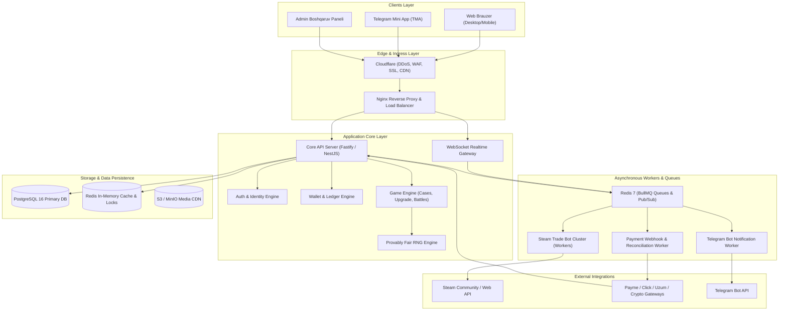
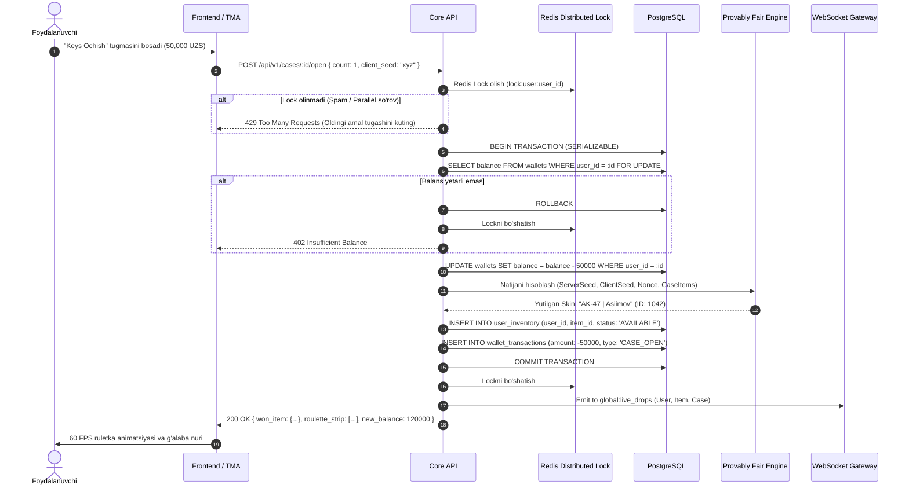

# TIZIM ARXITEKTURASI HUJJATI (SYSTEM ARCHITECTURE DESIGN)

**Loyiha:** SKINOZ / csskinuz  
**Hujjat versiyasi:** 1.0.0  
**Holati:** Ishlab chiqish uchun tasdiqlangan arxitektura  
**Til:** O'zbek tili  

---

## 1. YUQORI DARAJADAGI TIZIM STRUKTURASI (HIGH-LEVEL ARCHITECTURE)

Platforma yuqori unumdorlik, xavfsizlik va o'yin jarayonining kechikishsiz (low-latency) ishlashini ta'minlash uchun **Modulli Monolit (Modular Monolith) + Ixtisoslashtirilgan Workerlar Klasteri** arxitekturasi asosida quriladi.

---

## 2. ASOSIY KOMPONENTLAR VA ULARNING VAZIFALARI

### 2.1. Mijozlar Qatlami (Client Layer)
* **Web Ilova (Desktop & Mobile):** Next.js 14+ (App Router) yoki React 19 + Vite. SSR/SSG yordamida SEO optimallashtirilgan sahifalar, mijoz tomonida esa Canvas/Framer Motion bilan 60 FPS silliq ochilish animatsiyalari.
* **Telegram Mini App (TMA):** `@telegram-apps/sdk` orqali Telegram kontekstida ishlovchi, tebranish (Haptic Feedback), xavfsiz to'lov va yopilishni oldini olish xususiyatlariga ega mobil interfeys.
* **Admin Dashboard:** Xavfsiz, faqat oq ro'yxatdagi IP lar uchun ochiq boshqaruv tizimi (React + Shadcn UI).

### 2.2. Asosiy Backend Server (Core API Server)
* **Texnologiya:** Node.js (TypeScript) + Fastify (yoki NestJS) yuqori so'rov o'tkazish qobiliyati (RPS) uchun.
* **Asosiy Modullar:**
  1. `AuthModule`: Telegram `initData` HMAC tekshiruvi, Steam OpenID 2.0 sessiyalari, JWT rotatsiyasi.
  2. `WalletModule`: Tranzaksiyalar izolyatsiyasi, manfiy balansdan himoya, ikki tomonlama buxgalteriya.
  3. `GameModule`: Keys ochish, apgreyd ehtimolliklari, PvP janglar mantig'i.
  4. `ProvablyFairModule`: Kriptografik tasodifiylik generatsiyasi.

### 2.3. Real Vaqt Gateway (WebSocket Gateway)
* **Texnologiya:** `Socket.io` yoki `uWebSockets.js` Redis Adapter bilan.
* **Kanallar (Rooms/Topics):**
  - `global:live_drops` — Butun platformadagi yangi yutuqlar oqimi.
  - `battle:{id}` — Jonli keys jangi xonasi o'yinchilari va tomoshabinlari uchun sinxron holat.
  - `user:{id}` — Shaxsiy bildirishnomalar (Trade taklifi keldi, depozit o'tdi).

### 2.4. Steam Savdo Botlari Klasteri (Steam Worker Cluster)
* **Vazifasi:** Steam platformasida skinlarni xavfsiz qabul qilish va foydalanuvchilarning Steam hisobiga Trade Offer orqali yetkazib berish.
* **Tuzilishi:**
  - Har bir bot alohida worker jarayoni sifatida ishlaydi (`node-steam-tradeoffer-manager`, `steam-totp`).
  - Botlarning holati (Online, Busy, RateLimited, Banned) Redis da saqlanadi.
  - Trade offerlar BullMQ navbati orqali taqsimlanadi.

---

## 3. MA'LUMOTLAR OQIMI VA KETMA-KETLIK DIAGRAMMASI (SEQUENCE FLOWS)

### 3.1. Keys Ochish Jarayoni (Case Opening Flow)

---

## 4. MASSHTABLANISH VA YUKLAMAGA BARDOSHLILIK (SCALABILITY DESIGN)

1. **Gorizontal Kengayish (Stateless API):** Barcha API serverlar sessiya ma'lumotlarini o'z xotirasida emas, faqat Redis va JWT da saqlaydi. Natijada foydalanuvchilar soni oshganda yangi API nusxalarini (Replicas) osonlikcha qo'shish mumkin.
2. **Ma'lumotlar Bazasi O'qish/Yozish Ajratilishi (Read/Write Replicas):** 
   - Yozish (Write): Asosiy Primary DB ga barcha to'lovlar, ochishlar va savdolar yoziladi.
   - O'qish (Read): Keyslar katalogi, yordamchi sahifalar va yetakchilar jadvali Read Replica lardan o'qiladi.
3. **Kesh Strategiyasi (Cache-Aside):** Keyslar tarkibi, skinlar narxlari va statik ma'lumotlar Redis keshida 1 soatgacha saqlanadi va DB ga yuklamani 85% ga kamaytiradi.
