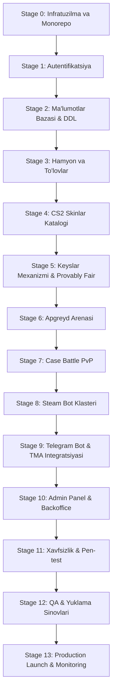

# ISHLAB CHIQISH ROADMAPI VA BOSQICHLARI (STAGE-BY-STAGE BUILD ROADMAP)

**Loyiha:** SKINOZ / csskinuz  
**Hujjat turi:** Bosqichma-bosqich ishlab chiqish rejasi va Definition of Done (DoD)  
**Til:** O'zbek tili  

---

## 1. ISHLAB CHIQISH BOSQICHLARI MATRITSASI (STAGES 0 — 14)

---

## 2. HAR BIR BOSQICHNING CHUQUR SPETSIFIKATSIYASI

### STAGE 0 — Infratuzilma va Monorepo Muhiti
* **Maqsad:** Docker muhiti, PostgreSQL 16, Redis 7, monorepo strukturasi (`pnpm workspace` yoki `Turborepo`) va CI/CD ni sozlash.
* **Fayllar:** `docker-compose.yml`, `package.json`, `pnpm-workspace.yaml`, `.env.example`.
* **Definition of Done:** Barcha xizmatlar `docker compose up` orqali xatosiz ishga tushadi, lint va build muvaffaqiyatli o'tadi.

### STAGE 1 — Autentifikatsiya va Identifikatsiya
* **Maqsad:** Telegram WebApp `initData` (HMAC-SHA256) va Steam OpenID 2.0 orqali kirishni to'liq dasturlash.
* **API o'zgarishlari:** `POST /api/v1/auth/telegram`, `GET /api/v1/auth/steam/callback`.
* **Xavfsizlik tekshiruvi:** Muddati o'tgan yoki soxta imzo bilan yuborilgan so'rovlarni rad etish.
* **Definition of Done:** Foydalanuvchi Telegram Mini App orqali hamda brauzerda Steam orqali 1-klikda ro'yxatdan o'tib, JWT sessiya oladi.

### STAGE 2 — Ma'lumotlar Bazasi va ORM/Migratsiyalar
* **Maqsad:** `docs/DATABASE_DESIGN.md` dagi barcha DDL jadvallari, indekslari va cheklovlarini Drizzle/Prisma yoki toza SQL migratsiyalari orqali bazaga kiritish.
* **Definition of Done:** Barcha jadvallar, munosabatlar va `CHECK` cheklovlari PostgreSQL da xatosiz yaratilgan.

### STAGE 3 — Hamyon, Tranzaksiyalar va To'lov Shlyuzlari
* **Maqsad:** Ikki tomonlama buxgalteriya (Double-entry ledger), Payme, Click, Uzum shlyuzlari integratsiyasi va Wager requirement hisobi.
* **Xavfsizlik tekshiruvi:** Webhooklar HMAC/IP tekshiruvi, Idempotency-Key takrorlanmasligi, `SELECT FOR UPDATE` qulflari.
* **Definition of Done:** Real hisobdan to'lov amalga oshirilgach, balans 1 soniyada to'ldiriladi va manfiy balansga tushish xavfi 100% yo'q qilinadi.

### STAGE 4 — CS2 Skinlar Katalogi va Narxlar Sinxroni
* **Maqsad:** Barcha CS2 skinlarining ma'lumotlar bazasi, rasmlari (CDN), kamyoblik toifalari va bozor narxlarini (CSFloat/Skinport) avtomatik yangilovchi kesh servisi.
* **Definition of Done:** 10,000+ CS2 skinlari bazada mavjud va narxlari har 1 soatda avtomatik yangilanadi.

### STAGE 5 — Keyslar Engine va Provably Fair Ochish
* **Maqsad:** Keyslar katalogi, drop weight ehtimolliklari, HMAC-SHA256 Provably Fair algoritmi va 60 FPS gorizontal ruletka animatsiyasi.
* **Definition of Done:** Foydalanuvchi keys ochadi, balansidan pul yechiladi, natija serverda aniqlanadi, skin inventarga tushadi va Live Drops ga chiqadi.

### STAGE 6 — Apgreyd (Upgrade) Arenasi
* **Maqsad:** Foydalanuvchi o'z skini yoki balansi bilan maqsadli skinni yutib olishi uchun aylanuvchi disk arenasi va matematik RTP hisobi.
* **Definition of Done:** Foydalanuvchi skinni tanlaydi, ehtimollik hisoblanadi, disk aylanadi va g'alaba/mag'lubiyat holatiga ko'ra inventar yangilanadi.

### STAGE 7 — Case Battle PvP (O'yinchilar Jangi)
* **Maqsad:** 2-4 kishilik sinxron keys ochish xonalari, WebSocket integratsiyasi, Crazy Mode va AI bot raqiblarni chaqirish.
* **Definition of Done:** Ikkita o'yinchi bir vaqtda bitta xonaga kiradi, keyslar sinxron ochiladi va jami eng yuqori summa yig'gan o'yinchi barcha skinlarni oladi.

### STAGE 8 — Steam Savdo Botlari Klasteri
* **Maqsad:** Node.js Steam Trade Offer Workerlari, 2FA mobil tasdiqlash, inventarni boshqarish va foydalanuvchiga skinni yetkazib berish.
* **Definition of Done:** Foydalanuvchi "Yechib olish" tugmasini bosganda, Steam boti 60 soniya ichida foydalanuvchining Steam hisobiga savdo taklifini yuboradi.

### STAGE 9 — Telegram Bot, Referrallar va Kunlik Bonuslar
* **Maqsad:** Telegram bot xabarnomalari, shaxsiy referral havolalari (+5-10% keshbek), kunlik bepul keyslar va obunani tekshirish.
* **Definition of Done:** Bot orqali kelgan foydalanuvchilar o'z do'stlarini taklif qilib, ularning depozitidan avtomatik foiz oladi.

### STAGE 10 — Admin Boshqaruv Paneli
* **Maqsad:** Boshqaruv dashboardi, keyslar konstruktori, botlar inventari holati, yirik yechishlarni tasdiqlash va audit jurnallari.
* **Definition of Done:** Administrator yangi keys yarata oladi, uning RTP sini o'zgartira oladi va shubhali o'yinchilarni bloklay oladi.

### STAGE 11 — Xavfsizlik va Pen-Testing
* **Maqsad:** Poyga holatlari (Race Conditions), IDOR, SQL injection, XSS, CSRF, Replay hujumlarini avtomatlashgan skriptlar bilan sinash.
* **Definition of Done:** Barcha zaifliklar bartaraf etilgan, 100 ta parallel ochishda bitta ham balans xatosi kuzatilmaydi.

### STAGE 12 — Yuklama Sinovlari va QA (Load Testing)
* **Maqsad:** k6 yoki Artillery yordamida 5,000 CCU yuklama ostida tizimning barqarorligini tekshirish.
* **Definition of Done:** 5,000 faol virtual foydalanuvchi ochishlar qilganda API kechikishi $\le 200\text{ ms}$ va 0 ta xatolik (0% Error rate).

### STAGE 13 — Production Launch va Monitoring
* **Maqsad:** Saytni ishlab chiqarish (Production) serverlariga chiqarish, Cloudflare, Sentry, Grafana va Prometheus monitoringini yoqish.
* **Definition of Done:** Tizim 24/7 rejimda to'liq avtonom va xavfsiz ishlamoqda.
