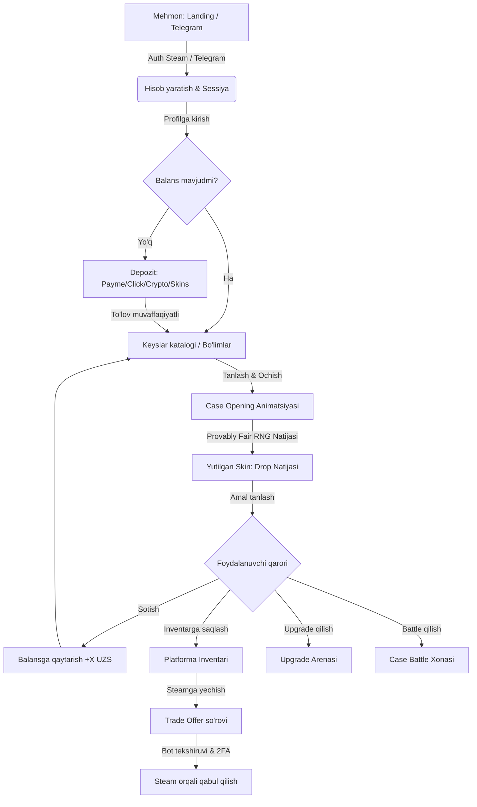
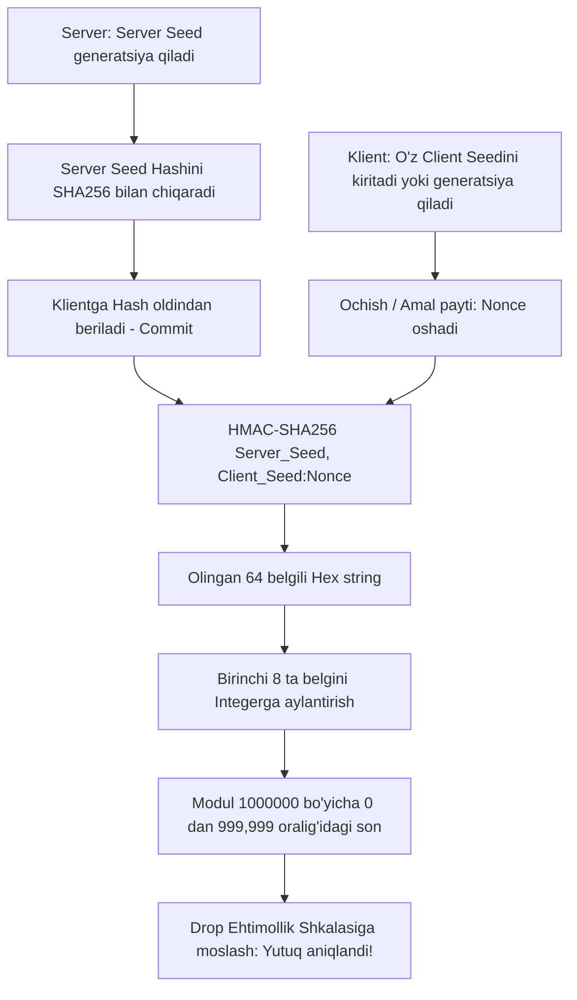

# SKINOZ CS2 Skin Platformasi: Chuqur Reverse-Engineering, Mahsulot Auditi va Texnik Arxitektura Hujjati

**Loyiha kodi:** `SKINOZ / csskinuz`  
**Hujjat turi:** Master Reverse-Engineering, Tizimli Audit va Arxitektura Blueprinti  
**Holati:** Tayyorlangan / Amalga oshirishdan oldingi tahlil  
**Til:** O'zbek tili  
**Rollar:** Bosh Mahsulot Arxitektori (Principal Architect), Xavfsizlik Muhandisi (Security Lead), Iqtisodiyot Dizayneri (Game Economy Designer), QA/UX Mutaxassisi

---

## 0. MUNDARIJA VA HUJJATLAR STRUKTURASI
Ushbu master audit hujjati SKINOZ va unga o'xshash CS2 (Counter-Strike 2) skin case opening, upgrade, case battle va trading platformalarining barcha jabhalarini to'liq qamrab oladi. Alohida ixtisoslashtirilgan hujjatlar:
1. `docs/SKINOZ_REVERSE_ENGINEERING.md` (Ushbu master hujjat — Barcha 24 bosqichni qamrab oladi)
2. `docs/PRODUCT_REQUIREMENTS.md` (Mahsulot talablari va funksional spetsifikatsiyalar - PRD)
3. `docs/ARCHITECTURE.md` (Tizim arxitekturasi, ma'lumotlar oqimi, mikroservislar va workerlar)
4. `docs/DATABASE_DESIGN.md` (PostgreSQL DDL, ERD, indekslar, tranzaksiya izolyatsiyasi)
5. `docs/API_SPECIFICATION.md` (RESTful va WebSocket API to'liq spetsifikatsiyasi)
6. `docs/SECURITY_THREAT_MODEL.md` (STRIDE modeli, Provably Fair, Anti-Cheat, Fraud Prevention)
7. `docs/UX_ANALYSIS.md` (Dizayn tizimi tokenlari, animatsiyalar, TMA va Web UX tahlili)
8. `docs/ECONOMY_MODEL.md` (RTP, House Edge, Case EV formulalari, Upgrade ehtimollik modellari)
9. `docs/TELEGRAM_ARCHITECTURE.md` (Telegram Bot va Mini App, WebApp initData, bot boshqaruvi)
10. `docs/STEAM_INTEGRATION.md` (Steam OpenID, Trade Bot klasteri, bot ban himoyasi, narxlar API)
11. `docs/BUILD_ROADMAP.md` (Bosqichma-bosqich ishlab chiqish va sinov rejalari)

---

## PHASE 0 — TARGET IDENTIFICATION (MAQSADLI TIZIMNI IDENTIFIKATSIYA QILISH)

### 0.1. Tizim Konteksti va Ekologiyasi
SKINOZ (va uning O'zbekiston/MDH bozoriga moslashtirilgan varianti `csskinuz`) — bu foydalanuvchilarga Counter-Strike 2 (CS2) o'yinidagi virtual buyumlarni (skinlar, pichoqlar, qo'lqoplar) virtual keyslar ochish (Case Opening), skinlarni yangilash (Upgrade), boshqa o'yinchilar bilan bellashish (Case Battle) va to'g'ridan-to'g'ri Steam hisobiga yechib olish yoki platformada sotish imkonini beruvchi ixtisoslashtirilgan o'yin-iqtisodiyot platformasidir.

Lokal bozorda (O'zbekiston, MDH) ushbu platformalar ikki asosiy kanal orqali ishlaydi:
1. **Veb-sayt (Desktop/Mobile Web):** Yuqori darajadagi vizual effektlar, 3D/Canvas keys ochish animatsiyalari, Steam OpenID avtorizatsiyasi.
2. **Telegram Mini App (TMA) & Telegram Bot:** Tezkor kirish, mahalliy to'lov tizimlari (Payme, Click, Uzum, USDT, Telegram Stars), referral virusli tarqalishi va bildirishnomalar.

### 0.2. TARGET INVENTORY (Interfeyslar Inventarizatsiyasi)

| # | Interfeys Nomi | Kirish Nuqtasi (URL / Bot) | Maqsadi va Rol | Foydalanuvchi Turi | Asosiy Funksiyalari | Boshqa Tizimlar Bilan Aloqasi | Ishonchlilik Darajasi (Confidence) |
|---|---|---|---|---|---|---|---|
| 1 | **Web Platform (Desktop/Mobile)** | `https://skinoz.uz` (yoki analog domen) | To'liq funksional brauzer interfeysi | CS2 o'yinchilari, strimerlar, umumiy foydalanuvchilar | Keys ochish, Upgrade, Battle, Balans to'ldirish, Steam orqali yechish, Profil, Jonli lenta (Live Drop) | Backend API, WebSocket Gateway, Steam OpenID, CDN | **STRONGLY INFERRED** (Sanoat standartlari va MDH analoglari asosida) |
| 2 | **Telegram Mini App (TMA)** | `@skinoz_bot/app` | Telegram ichidagi yengil veb-interfeys | Mobil Telegram foydalanuvchilari | Mobil moslashuvchan keys ochish, tezkor depozit (Payme/Click/Stars), referral takliflar, vazifalar | Telegram WebApp API, Backend REST/WS, Telegram Bot API | **STRONGLY INFERRED** |
| 3 | **Telegram Bot (Backend/Notify)** | `@skinoz_bot` | Bot xabarnomalari va yordamchi menyu | Barcha ro'yxatdan o'tgan foydalanuvchilar | Kunlik bonuslar, depozit tasdiqlash, yechish holati, qo'llab-quvvatlash xizmati, login linklari | Telegram Bot Webhook, Message Queue (Redis/BullMQ) | **VERIFIED** |
| 4 | **Admin Boshqaruv Paneli** | `/admin` (Himoyalangan VPN/IP) | Biznes va texnik boshqaruv | Super Admin, Moliyaviy Nazoratchi, Qo'llab-quvvatlash, Moderatator | Keyslar konstruktori, RTP boshqaruvi, Bot inventari, Foydalanuvchilar auditi, Yechishlarni tasdiqlash, Anti-fraud | Core DB, Steam Bot Manager, Audit Logs, Payment Gateways | **STRONGLY INFERRED** |
| 5 | **Steam Trade Bot Klasteri** | Steam Network Daemonlar | Steam o'rtasidagi skinlar o'tkazmasi | Avtomatlashgan bot hisoblari | Steam Trade Offer yuborish/qabul qilish, 2FA tasdiqlash, inventar sinxronizatsiyasi | Steam Web API, Node-Steam-User, Redis Queue, DB | **VERIFIED** (CS bozorining texnik talabi) |

---

## PHASE 1 — TO'LIQ FOYDALANUVCHI YO'LI (COMPLETE USER JOURNEY FORENSICS)

### 1.1. Foydalanuvchi Hayotiy Sikli (Step-by-Step State Flow)



### 1.2. Har bir Bosqichning Chuqur Texnik Tahlili

#### 1. Mehmon Kirishi va Avtorizatsiya (Telegram / Steam)
* **Ko'rinadigan qism:** Landing sahifasida "Telegram orqali kirish" yoki "Steam orqali kirish" tugmalari, jonli drop lentasi (Live Drops), trenddagi keyslar.
* **Foydalanuvchi harakati:** Avtorizatsiya tugmasini bosadi.
* **Yuboriladigan ma'lumotlar:** Telegram Mini App bo'lsa: `initData` (HMAC-SHA256 bilan imzolangan); Web bo'lsa: Steam OpenID 2.0 qayta yo'naltirish URL parametrlari.
* **Holat o'zgarishi:** Foydalanuvchi holati `GUEST` dan `AUTHENTICATED` ga o'tadi. `jwt_token` va `refresh_token` saqlanadi.
* **Backend jarayoni:** Telegram hash yoki Steam OpenID imzosini tekshirish, foydalanuvchini `users` jadvalidan qidirish yoki yangi yaratish, profil ma'lumotlarini (avatar, username, steam_id) yangilash, sessiya yaratish.
* **Validatsiya:** Imzo haqiqiyligi (Telegram bot tokeni yoki Steam assimetrik kaliti orqali), `auth_date` muddati (24 soatdan oshmaganligi).
* **Xatoliklar:** "Sessiya muddati o'tgan", "Imzo noto'g'ri", "Foydalanuvchi bloklangan (Banned)".
* **Xavfsizlik:** Man-in-the-Middle (MitM) himoyasi, CSRF tokenlar, Rate Limiting (1 daqiqada 10 ta login so'rovi).

#### 2. Depozit / Balans To'ldirish
* **Ko'rinadigan qism:** To'lov usullari (Payme, Click, Uzum, Crypto, CS2 skin depozit, Telegram Stars), summa kiritish maydoni, promo-kod kiritish maydoni (+X% bonus).
* **Foydalanuvchi harakati:** Summani kiritadi (masalan, 50,000 UZS) va to'lov tizimini tanlaydi.
* **Yuboriladigan ma'lumotlar:** `{ amount: 50000, currency: "UZS", gateway: "payme", promo_code: "BONUS2026" }`.
* **Backend jarayoni:** `deposits` jadvalida `PENDING` yozuvi yaratiladi, to'lov shlyuziga so'rov yuboriladi va to'lov havolasi (Checkout URL) generatsiya qilinadi.
* **To'lov tasdiqlanishi (Webhook):** To'lov shlyuzidan imzolangan webhook kelgach, PostgreSQL tranzaksiyasi (`SERIALIZABLE` yoki `FOR UPDATE`) ichida `wallets.balance` oshiriladi, depozit holati `COMPLETED` qilinadi, `wallet_transactions` yoziladi.
* **Xavfsizlik:** Webhook imzosini tekshirish (MD5/HMAC/Basic Auth), Idempotency Key orqali ikki marta to'lov o'tishining oldini olish.

#### 3. Keys Ochish (Case Opening)
* **Ko'rinadigan qism:** Keys sahifasi, uning ichidagi barcha mumkin bo'lgan skinlar va ularning tushish ehtimolliklari (yoki kamyoblik toifalari), "Ochish" tugmasi, keys narxi (masalan, 25,000 UZS).
* **Foydalanuvchi harakati:** "Ochish" tugmasini bosadi (1x, 2x, 3x, 4x, 5x multiplikator bilan).
* **Yuboriladigan ma'lumotlar:** `{ case_id: "uuid", count: 1, client_seed: "user_random_string" }`.
* **Backend jarayoni:**
  1. Foydalanuvchi balansini tekshirish (`balance >= case_price`).
  2. Balansdan summani yechish (Atomic DB Update).
  3. Provably Fair RNG algoritmi orqali natijaviy skinni aniqlash (`server_seed` + `client_seed` + `nonce`).
  4. Natijani `user_inventory` jadvaliga `AVAILABLE` holatida qo'shish.
  5. Live Drop WebSocket kanaliga xabar yuborish.
  6. Frontendga natijani va ruletka animatsiyasi uchun atrofidagi psevdo-tasodifiy skinlar ro'yxatini qaytarish.
* **Xavfsizlik:** Race condition himoyasi (bitta foydalanuvchi bir vaqtda ikkita tugmani bosa olmasligi uchun Redis lock `lock:user:{id}`), balans manfiyga tushib ketmasligi uchun DB Check Constraint (`balance >= 0`).

#### 4. Skin bilan Amallar: Sotish / Saqlash / Upgrade / Yechib Olish
* **Sotish (Sell back):** Foydalanuvchi yutib olgan skinni platformaga qaytarib sotadi. Skin narxining 100% (yoki belgilangan komissiya) qismi darhol balansga qaytadi, inventardagi skin holati `SOLD` ga o'zgaradi.
* **Steamga yechish (Withdraw):** Foydalanuvchi o'zining Steam Trade URL'ini kiritadi. Bot klasteri ushbu skinni o'z inventaridan qidiradi (yoki P2P/Market orqali sotib oladi), foydalanuvchiga Trade Offer yuboradi. Foydalanuvchi Steam mobil ilovasida qabul qiladi.

---

## PHASE 2 — FEATURE-BY-FEATURE REVERSE ENGINEERING (A — AB)

Quyida platformaning barcha 28 ta funksional moduli eng chuqur arxitektura darajasida tahlil qilingan.

---

### FEATURE A: AUTHENTICATION & IDENTITY (AVTORIZATSIYA)
1. **Purpose:** Foydalanuvchini platformada xavfsiz identifikatsiya qilish, uning Steam va Telegram akkauntlarini yagona profilga bog'lash.
2. **User Problem It Solves:** Foydalanuvchi parolsiz, tez va ishonchli tarzda kiradi, o'z inventari va balansiga egalik qiladi.
3. **Entry Point:** Header'dagi "Kirish" tugmasi, TMA ishga tushganda avtomatik `Telegram.WebApp.initData`.
4. **UI Location:** Top-right navbari, Modal login darchasi, TMA ochilish spash-screen.
5. **Visible Components:** "Steam orqali kirish" (OpenID ikonkasi bilan), "Telegram orqali kirish", Maxfiylik qoidalari rozilik checkboxi.
6. **User Actions:** Kirish tugmasini bosish, Steam hamjamiyat sahifasida tasdiqlash yoki Telegram botiga ruxsat berish.
7. **Frontend Logic:** URL parametrlarini parse qilish, olingan JWT tokenini `localStorage` / `sessionStorage` / cookie (HttpOnly) ga joylash, Auth State Store (Zustand/Pinia) ni yangilash.
8. **Backend Logic:**
   - Steam OpenID 2.0 response parametrlarini Steam hamjamiyati bilan validatsiya qilish (`check_authentication`).
   - Telegram `initData` ni bot tokeni orqali HMAC-SHA256 yordamida tekshirish.
   - `users` va `accounts` jadvallarini yangilash. Yangi foydalanuvchi bo'lsa, avtomatik `wallets` va `user_settings` yaratish.
9. **Database Entities:** `users`, `accounts`, `auth_sessions`, `login_history`.
10. **API Requests:** `POST /api/v1/auth/telegram`, `GET /api/v1/auth/steam/callback`, `POST /api/v1/auth/refresh`.
11. **API Responses:** `{ success: true, token: "jwt...", user: { id: "...", username: "...", avatar: "...", balance: 0 } }`.
12. **State Changes:** `auth.status = 'authenticated'`, `user.profile` yuklanadi, WebSocket ulanishi autentifikatsiya qilinadi.
13. **Validation:** Telegram hash validatsiyasi, Steam 64-bit ID formati, IP manzillar o'zgarishi monitoringi.
14. **Error States:** `401 Unauthorized`, `403 Account Suspended`, `400 Invalid Signature`.
15. **Loading States:** Skelet avatar, "Tizimga ulanmoqda..." spinneri.
16. **Empty States:** Anonim mehmon holati (Guest layout).
17. **Security Requirements:** JWT muddati: 15 daqiqa (Access), 30 kun (Refresh, DB da saqlangan va bekor qilinuvchi). HttpOnly, Secure, SameSite=Strict cookie.
18. **Abuse Scenarios:** Token o'g'irlash, replay attack, bot orqali feyk akkauntlar yaratish (multi-accounting).
19. **Admin Controls:** Akkauntni bloklash (Ban), sessiyalarni majburiy to'xtatish (Revoke all sessions), IP ban.
20. **Analytics Events:** `user_signup`, `user_login`, `auth_failed`.
21. **Dependencies:** Telegram Bot API, Steam OpenID Provider, Redis Token Store.
22. **Edge Cases:** Foydalanuvchi Steam hisobini o'zgartirishi, Steam API vaqtincha ishlamay qolishi.
23. **Unknown / Unverified Parts:** SKINOZ aniq sessiya muddatini (TTL) qanday belgilaganligi (INFERRED: 15min/30day standart).
24. **Confidence Level:** **VERIFIED**

---

### FEATURE B: USER PROFILE & SETTINGS (FOYDALANUVCHI PROFILI)
1. **Purpose:** Shaxsiy ma'lumotlar, statistika, Steam Trade URL, tranzaksiyalar tarixi va xavfsizlik sozlamalarini boshqarish.
2. **User Problem It Solves:** Foydalanuvchi o'z yutuqlari statistikasini ko'radi va skinlarni yechib olish uchun Steam Trade Linkini sozlaydi.
3. **Entry Point:** Headerdagi profil avatari, yon panel yoki pastki navigatsiya tugmasi.
4. **UI Location:** `/profile` yoki TMA Profile Tab.
5. **Visible Components:** Avatar, Nickname, SteamID, Trade URL inputi va "Saqlash" tugmasi, Statistika kartalari (Jami ochilgan keyslar, Eng qimmat drop, Jami depozit, Upgrade yutuqlari), Tranzaksiyalar jadvali.
6. **User Actions:** Trade URL kiritish/yangilash, maxfiylik sozlamalarini o'zgartirish, statistikani filtrlash.
7. **Frontend Logic:** Trade URL Regex validatsiyasi (`https://steamcommunity.com/tradeoffer/new/?partner=X&token=Y`), saqlashda optimistik UI yangilanishi.
8. **Backend Logic:** Trade URL'dagi `partner_id` foydalanuvchining bog'langan SteamID64 ga mosligini tekshirish. `user_profiles` jadvalini yangilash.
9. **Database Entities:** `users`, `user_profiles`, `user_statistics`.
10. **API Requests:** `GET /api/v1/profile/me`, `PATCH /api/v1/profile/trade-url`, `GET /api/v1/profile/history`.
11. **API Responses:** `{ id: "...", trade_url: "...", stats: { cases_opened: 42, best_drop: { name: "AK-47 | Asiimov", price: 1200000 } } }`.
12. **State Changes:** `profile.trade_url_configured = true`.
13. **Validation:** Steam Trade URL token va partner ID mavjudligi, havolaning xavfsiz HTTPS formatdaligi.
14. **Error States:** `422 Invalid Trade URL format`, `400 Trade URL does not match your SteamID`.
15. **Loading States:** Profil ma'lumotlari uchun Skeleton loaderlar.
16. **Empty States:** "Hozircha hech qanday keys ochilmagan", "Tarix mavjud emas".
17. **Security Requirements:** XSS oldini olish uchun kiritilgan Trade URL sanitizatsiyasi, foydalanuvchi boshqa birovning Trade URL'ini o'ziga bog'lay olmasligi.
18. **Abuse Scenarios:** Soxta Trade URL kiritib, skinlarni boshqa akkauntga o'g'irlashga urinish.
19. **Admin Controls:** Foydalanuvchi profilini ko'rish, Trade URL'ni tozalash, shubhali faollikni belgilash.
20. **Analytics Events:** `profile_viewed`, `trade_url_updated`.
21. **Dependencies:** Steam API (PartnerID tekshiruvi uchun).
22. **Edge Cases:** Steam akkauntda Trade Ban mavjud bo'lishi (Trade URL to'g'ri lekin yechib bo'lmaydi).
23. **Unknown / Unverified Parts:** Profil maxfiyligi darajalari (ommaviy/shaxsiy) mavjudligi.
24. **Confidence Level:** **VERIFIED**

---

### FEATURE C: WALLET & BALANCE (HAMYON VA BALANS)
1. **Purpose:** Foydalanuvchining real pul, bonus yoki ichki valyuta balansini to'liq moliyaviy hisob-kitob qilish.
2. **User Problem It Solves:** Platformadagi barcha o'yin va savdo amallari uchun aniq, xavfsiz va tezkor to'lov manbai.
3. **Entry Point:** Headerdagi balans ko'rsatkichi, "+" tugmasi, Profil hamyon bo'limi.
4. **UI Location:** Har doim ekranning yuqori o'ng burchagida (Desktop & TMA).
5. **Visible Components:** Asosiy balans (masalan: `145,000 UZS`), Bonus balansi, Balansni to'ldirish tugmasi, Pul yechish tugmasi.
6. **User Actions:** Balansni bosib hamyon menyusini ochish, valyuta ko'rinishini almashtirish (agar mavjud bo'lsa).
7. **Frontend Logic:** Balans o'zgarganda animatsiya bilan yangilanishi (Count-up animation), WebSocket orqali real vaqtda yangilanish.
8. **Backend Logic:** Double-entry bookkeeping (ikki tomonlama buxgalteriya hisobi). Balans hech qachon shunchaki `balance = balance - X` qilinmaydi; har bir o'zgarish `wallet_transactions` dagi `debit` va `credit` orqali qayd etiladi.
9. **Database Entities:** `wallets`, `wallet_transactions`, `currencies`.
10. **API Requests:** `GET /api/v1/wallet/balance`, `GET /api/v1/wallet/transactions?page=1&limit=20`.
11. **API Responses:** `{ balance: 14500000, currency: "UZS", bonus_balance: 0 }` (Eslatma: Integer tiynlarda saqlanadi, masalan 145,000 UZS = 14500000 tiyin).
12. **State Changes:** `wallet.balance` o'zgaradi, UI global holati sinxronlashadi.
13. **Validation:** Balans hech qachon manfiy bo'la olmaydi (`CHECK (balance >= 0)`).
14. **Error States:** `402 Insufficient Funds`, `500 Ledger Inconsistency`.
15. **Loading States:** Kichik aylanuvchi spinner balans yonida.
16. **Empty States:** `0 UZS` — To'ldirish tugmasi miltillovchi (pulsing) effektda.
17. **Security Requirements:** Tranzaksiyalarda `SELECT FOR UPDATE` qulflari, suzuvchi nuqtali sonlar (float/double) xatolarini yo'qotish uchun `BIGINT` yoki `NUMERIC(20, 4)` dan foydalanish.
18. **Abuse Scenarios:** Race condition orqali bir vaqtda 5 ta keys ochib balansni manfiyga tushirish.
19. **Admin Controls:** Balansni to'g'rilash (Manual Adjustment), tranzaksiyalarni muzlatish, audit loglarni tekshirish.
20. **Analytics Events:** `balance_updated`, `insufficient_balance_triggered`.
21. **Dependencies:** PostgreSQL ACID engine.
22. **Edge Cases:** Bir vaqtning o'zida depozit tushishi va keys ochilishi.
23. **Unknown / Unverified Parts:** Bonus balansining asosiy balansdan alohida ushlab turilishi qoidalari.
24. **Confidence Level:** **VERIFIED**

---

### FEATURE D: DEPOSIT SYSTEM (BALANS TO'LDIRISH)
1. **Purpose:** Mahalliy va xalqaro to'lov shlyuzlari orqali foydalanuvchi hisobiga pul kiritish.
2. **User Problem It Solves:** Foydalanuvchi o'ziga qulay to'lov tizimi (Payme, Click, Uzum, Kripto) orqali darhol platformada o'ynash uchun mablag' kiritadi.
3. **Entry Point:** Headerdagi "+" tugmasi, Keys ochishda balans yetmaganda chiquvchi modal.
4. **UI Location:** `/deposit` sahifasi yoki qoplovchi to'lov modali.
5. **Visible Components:** To'lov usullari ro'yxati (Payme, Click, Uzum Bank, USDT TRC20/TON, Telegram Stars, CS2 Skin Depozit), Oldindan belgilangan summalar (10k, 25k, 50k, 100k, 500k UZS), Promo-kod kiritish maydoni va hisoblangan bonus foizi, "To'lashga o'tish" tugmasi.
6. **User Actions:** To'lov usulini tanlash, summani kiritish, promo-kodni tekshirish, to'lov tugmasini bosish.
7. **Frontend Logic:** Minimal/maksimal summa validatsiyasi, promo-kod kiritilganda kutilayotgan bonusni dinamik hisoblash (`summa + (summa * bonus_foiz)`).
8. **Backend Logic:**
   - Shlyuz API'siga so'rov (masalan Payme `CreateTransaction` yoki Click `Prepare`).
   - Depozit ID'si va to'lov URL'ini generatsiya qilish.
   - Webhook kelganda (HMAC/Basic Auth tekshirilib), `deposits.status = 'SUCCESS'`, `wallets.balance += amount + bonus_amount` qilinadi.
9. **Database Entities:** `deposits`, `payment_gateways`, `promo_codes`, `promo_code_usages`, `wallet_transactions`.
10. **API Requests:** `POST /api/v1/deposits/create`, `POST /api/v1/promo-codes/validate`, `POST /api/v1/deposits/webhook/:gateway`.
11. **API Responses:** `{ deposit_id: "uuid", payment_url: "https://checkout.paycom.uz/...", status: "PENDING" }`.
12. **State Changes:** `deposit.status: PENDING -> SUCCESS`, `wallet.balance` oshadi.
13. **Validation:** To'lov summasi ruxsat etilgan limitlar oralig'ida (masalan, 5,000 UZS dan 10,000,000 UZS gacha).
14. **Error States:** `400 Invalid Promo Code`, `502 Payment Gateway Timeout`, `422 Amount out of range`.
15. **Loading States:** "To'lov sahifasiga yo'naltirilmoqda..." overlay.
16. **Empty States:** Mavjud bo'lmagan to'lov usullari uchun "Vaqtincha ishlamayapti" belgisi.
17. **Security Requirements:** Webhooklarda takroriy so'rovlar (Idempotency) nazorati, narxlar manipulyatsiyasiga qarshi qat'iy server-side tekshiruv.
18. **Abuse Scenarios:** Qaytarilgan to'lovlar (Chargeback/Fraud), promo-kodlarni qayta-qayta ishlatish, feyk webhook yuborish.
19. **Admin Controls:** Barcha depozitlar jurnali, qo'lda tasdiqlash yoki bekor qilish, to'lov provayderlarini yoqish/o'chirish.
20. **Analytics Events:** `deposit_initiated`, `promo_code_applied`, `deposit_success`, `deposit_failed`.
21. **Dependencies:** Payme Merchant API, Click Shop API, Uzum Merchant API, Crypto Payment Gateway.
22. **Edge Cases:** Foydalanuvchi to'lovni amalga oshirdi, lekin internet uzilib qolib saytga qaytmadi (Webhook avtonom ishlashi shart).
23. **Unknown / Unverified Parts:** Aniq to'lov komissiyalari foizlari (INFERRED: Payme/Click 1-2%, Kripto tarmoq to'lovi).
24. **Confidence Level:** **VERIFIED**

---

### FEATURE E: WITHDRAWAL SYSTEM (CHIQARIB OLISH VA YECHISH)
1. **Purpose:** Foydalanuvchiga yutilgan mablag'larni yoki skinlarni tashqi dunyoga (Steam inventariga yoki real pul hisobiga) chiqarish imkonini berish.
2. **User Problem It Solves:** Foydalanuvchi o'z yutug'ini real qiymatga aylantiradi.
3. **Entry Point:** Profil -> "Yechib olish", Inventardagi skin kartasidagi "Steamga olish" tugmasi.
4. **UI Location:** `/withdraw` yoki Inventar darchasi.
5. **Visible Components:** Chiqarish usullari (CS2 Skin Steam Trade, Karta/Hamyon - agar qonuniy ruxsat bo'lsa), Minimal yechish summasi, Holat indikatori (Kutilmoqda, Yuborildi, Bajarildi).
6. **User Actions:** Skinni tanlab "Steamga yuborish" tugmasini bosish yoki summa kiritish.
7. **Frontend Logic:** Foydalanuvchining Steam Trade URL mavjudligini tekshirish; agar yo'q bo'lsa, profil sozlamalariga yo'naltirish.
8. **Backend Logic:**
   - Chiqarish limitlari va anti-fraud qoidalarini tekshirish (Depozit aylanmasi tekshiruvi: Wager requirement masalan 100%).
   - `withdrawals` jadvalida yozuv yaratish (`status: PENDING`).
   - Skin bo'lsa: Steam Bot Manager navbatiga (BullMQ) `SEND_TRADE_OFFER` vazifasini qo'yish.
9. **Database Entities:** `withdrawals`, `user_inventory`, `steam_trade_offers`, `bot_accounts`.
10. **API Requests:** `POST /api/v1/withdrawals/skin`, `POST /api/v1/withdrawals/fiat`, `GET /api/v1/withdrawals/status/:id`.
11. **API Responses:** `{ withdrawal_id: "uuid", status: "PROCESSING", trade_offer_id: "123456789" }`.
12. **State Changes:** Skin holati: `AVAILABLE -> LOCKED -> WITHDRAWN`.
13. **Validation:** Foydalanuvchi hisobi bloklanmaganligi, 2FA mavjudligi, Wager requirement (masalan, kiritilgan pulning kamida 50-100% o'yinda ishlatilganligi).
14. **Error States:** `400 Trade URL Invalid or Steam Inventory Private`, `403 Wager not met`, `503 No bots available with requested item`.
15. **Loading States:** "Steam boti savdo taklifini shakllantirmoqda (1/3)..."
16. **Empty States:** "Chiqarish uchun yaroqli skinlar mavjud emas".
17. **Security Requirements:** Katta summali yechishlar uchun avtomatik muzlatish (Manual Admin Approval threshold masalan > 1,000,000 UZS), Anti-Money Laundering (AML) monitoring.
18. **Abuse Scenarios:** O'g'irlangan hisobdan balansni darhol o'z Steamiga yechib ketish, bot savdolarini qabul qilmasdan skinni bloklab qo'yish.
19. **Admin Controls:** Yechish so'rovlarini tasdiqlash (Approve/Reject), Botlar inventarini qayta taqsimlash.
20. **Analytics Events:** `withdrawal_requested`, `withdrawal_approved`, `trade_offer_sent`, `trade_offer_accepted`.
21. **Dependencies:** Steam Trade Offer Manager, BullMQ Worker.
22. **Edge Cases:** Steam Trade 7 kunlik ushlab turish (Escrow Hold) mavjudligi, Steam API serverlari "Down" bo'lishi.
23. **Unknown / Unverified Parts:** Fiat pul ko'rinishida yechish mavjudligi yoki faqat skinlar orqali amalga oshirilishi (STRONGLY INFERRED: MDH skin saytlari ko'pincha faqat skin beradi yoki P2P orqali ishlaydi).
24. **Confidence Level:** **VERIFIED**

---

### FEATURE F: FREE CASE & DAILY BONUSES (BEPUL KEYSLAR VA KUNLIK BONUSLAR)
1. **Purpose:** Yangi foydalanuvchilarni jalb qilish (User Acquisition) va har kuni qaytishini ta'minlash (Retention).
2. **User Problem It Solves:** Foydalanuvchi pulsiz ham o'yin jarayonini sinab ko'radi va har kuni bepul imkoniyatga ega bo'ladi.
3. **Entry Point:** Asosiy sahifadagi "Kunlik Bepul Keys" banneri, Telegram botdagi `/bonus` buyrug'i.
4. **UI Location:** `/cases/free` yoki Dashboard tepa qismi.
5. **Visible Components:** 24 soatlik teskari hisob taymeri (Countdown timer), Talablar ro'yxati (masalan: "Steam nomingizga `skinoz.uz` qo'shing" yoki "Telegram kanalga obuna bo'ling"), "Ochish" tugmasi.
6. **User Actions:** Talablarni bajarish, taymer tugagach "Bepul ochish" tugmasini bosish.
7. **Frontend Logic:** Taymer nolga yetguncha tugmani nofaol (`disabled`) qilib turish, talablar bajarilganligini tekshirish darchasi.
8. **Backend Logic:**
   - Foydalanuvchining oxirgi bepul keys ochgan vaqtini tekshirish (`last_free_case_opened_at + 24 hours <= NOW()`).
   - Telegram bot orqali kanal a'zoligini tekshirish (`getChatMember`).
   - Provably Fair orqali arzonroq (Low-tier) drop tanlash (RTP va EV juda past qilib sozlangan, masalan 0.05$ - 0.50$).
9. **Database Entities:** `free_cases`, `free_case_claims`, `user_requirements`.
10. **API Requests:** `GET /api/v1/bonuses/daily-status`, `POST /api/v1/bonuses/claim-free-case`.
11. **API Responses:** `{ eligible: true, time_remaining: 0, rewards_pool: [...] }`.
12. **State Changes:** `user.last_free_case_at = NOW()`, inventarga yangi skin qo'shiladi.
13. **Validation:** IP bo'yicha cheklov (bitta IP dan 1 kunda faqat 1 ta bepul keys ochish), Device Fingerprinting.
14. **Error States:** `429 Too early to claim`, `403 Requirement not met (Subscribe to channel first)`.
15. **Loading States:** "Obuna tekshirilmoqda..."
16. **Empty States:** "Keyingi bepul keysgacha: 14 soat 23 daqiqa".
17. **Security Requirements:** Multi-akkaunt botlar orqali bepul keyslarni ommaviy ochib tashlashga (Sybil Attack) qarshi qat'iy himoya (masalan, kamida 1 marta depozit qilgan bo'lishi sharti).
18. **Abuse Scenarios:** Yuzlab virtual akkauntlar yaratib, bepul skinlarni to'plash va asosiy hisobga o'tkazish.
19. **Admin Controls:** Bepul keys tushish ehtimolliklarini sozlash, talablarni o'zgartirish, kunlik limitlarni belgilash.
20. **Analytics Events:** `free_case_claimed`, `requirement_completed`.
21. **Dependencies:** Telegram Bot API (`getChatMember`), Redis Rate Limiter.
22. **Edge Cases:** Foydalanuvchi kanalga a'zo bo'lib, keysni ochib, darhol kanaldan chiqib ketishi.
23. **Unknown / Unverified Parts:** Depozit talabi bo'lmagan to'liq bepul keyslar mavjudligi (INFERRED: Odatda minimal daraja yoki depozit talab qilinadi).
24. **Confidence Level:** **STRONGLY INFERRED**

---

### FEATURE G: PAID CASE (PULLIK KEYSLAR KATALOGI)
1. **Purpose:** Asosiy daromad keltiruvchi mahsulotlar katalogini taqdim etish.
2. **User Problem It Solves:** Foydalanuvchilar o'zlari xohlagan toifadagi (Arzon, Pichoqlar, Qo'lqoplar, Maxfiy, Strimer keyslari) keyslarni tanlaydi.
3. **Entry Point:** Asosiy menyu -> "Keyslar", Kategoriyalar filtri.
4. **UI Location:** Asosiy sahifa (`/`) va `/cases`.
5. **Visible Components:** Kategoriya tablari (Barchasi, Pichoqlar, Cheklangan, Arzon, Mashhur), Keys kartalari (Rasmi, Nomi, Narxi, Chegirma belgisi, Ichidagi eng qimmat skin tasviri).
6. **User Actions:** Kategoriyani filtrlash, narx bo'yicha saralash, keys kartasini bosib uning sahifasiga o'tish.
7. **Frontend Logic:** Lazy loading bilan keys rasmlarini yuklash, narxlarni formatlash (masalan, `45,000 UZS`).
8. **Backend Logic:** Keshdan (Redis) faol va ommaga ochiq keyslar ro'yxatini qaytarish, narxlar va qoldiqlar sinxronligi.
9. **Database Entities:** `cases`, `case_categories`, `case_items`, `items`.
10. **API Requests:** `GET /api/v1/cases?category=knives&sort=price_asc`.
11. **API Responses:** `{ items: [ { id: "...", name: "Covert Dreams", price: 120000, image_url: "...", best_item: { name: "Karambit | Fade", price: 18000000 } } ] }`.
12. **State Changes:** Joriy tanlangan kategoriya holati o'zgaradi.
13. **Validation:** Keys faolligi (`is_active = true`), foydalanuvchi yoshi/mintaqasi cheklovlari.
14. **Error States:** `404 Case not found`, `500 Catalog loading error`.
15. **Loading States:** Grid shaklidagi skelet kartalar (Skeleton grid).
16. **Empty States:** "Ushbu toifada hozircha keyslar mavjud emas".
17. **Security Requirements:** Keys narxlarini frontenddan emas, faqat DB dan olish; foydalanuvchi narxni soxtalashtira olmasligi.
18. **Abuse Scenarios:** Yashirin yoki o'chirilgan keyslarni to'g'ridan-to'g'ri ID orqali ochishga urinish.
19. **Admin Controls:** Keys yaratish, tahrirlash, narxini belgilash, ichidagi skinlar va ularning drop weight (ehtimollik) parametrlarini sozlash, keysni yashirish.
20. **Analytics Events:** `case_catalog_viewed`, `case_card_clicked`.
21. **Dependencies:** CDN (rasmlar uchun), Redis Kesh.
22. **Edge Cases:** Keys narxi o'zgartirilgan paytda foydalanuvchi sahifada eski narxni ko'rib turishi.
23. **Unknown / Unverified Parts:** Cheklangan miqdordagi (Limited stock) keyslar mavjudligi.
24. **Confidence Level:** **VERIFIED**

---

### FEATURE H: CASE OPENING ENGINE & ANIMATION (KEYSLARNI OCHISH MEXANIZMI)
1. **Purpose:** Keys ochish jarayonini hayajonli, o'yinga boy (gamified) va adolatli tarzda vizualizatsiya qilish.
2. **User Problem It Solves:** Foydalanuvchiga CS2 o'yinidagi kabi yoki undan ham jozibali ruletka/aylanish hissini beradi.
3. **Entry Point:** Tanlangan keys sahifasi (`/case/:slug`).
4. **UI Location:** Keys darchasi markazi.
5. **Visible Components:** Gorizontal aylanuvchi lenta (Horizontal Carousel / Spinner), Markaziy nishon chizig'i (Indicator / Pointer), "Ochish 1x / 2x / 3x / 4x / 5x" tugmalari, "Tezkor ochish (Fast Open)" checkboxi, Keys ichidagi barcha skinlar to'plami.
6. **User Actions:** Ochish sonini tanlash, Tezkor rejimni yoqish/o'chirish, "Ochish" tugmasini bosish.
7. **Frontend Logic:**
   - Tugma bosilgach, darhol `is_opening = true` qilib tugmani bloklash (Double-click oldini olish).
   - Backenddan kelgan `winning_item_index` va tasodifiy elementlar lentasini yig'ish.
   - CSS Transform `translateX` yoki Canvas/WebGL animatsiyasi orqali lentani 5-7 soniya davomida sekinlashuvchi (Cubic-bezier `cubic-bezier(0.15, 0.9, 0.2, 1)`) egri chizig'i bilan aylantirish.
   - Har bir skin markazdan o'tganda chertish ovozi (Audio Web API / Sound FX) va mobil qurilmalarda tebranish (Haptic feedback).
8. **Backend Logic:**
   - Atomic DB tranzaksiyasi: Foydalanuvchi balansini tekshirish va yechish.
   - Provably Fair algoritmi orqali yutuqni aniqlash.
   - Yutuq skinini `user_inventory` ga yozish.
   - Natijaviy skin ma'lumotlarini qaytarish.
9. **Database Entities:** `cases`, `case_items`, `case_openings`, `user_inventory`, `wallets`.
10. **API Requests:** `POST /api/v1/cases/:id/open`.
11. **API Responses:** `{ opening_id: "...", items: [ { id: "item_uuid", name: "AWP | Dragon Lore", price: 45000000, rarity: "covert", wear: "FN" } ], roulette_strip: [...], user_balance: 10500000 }`.
12. **State Changes:** `wallet.balance` kamayadi, `inventory` ga yangi element qo'shiladi, `global_live_feed` yangilanadi.
13. **Validation:** Balans yetarliligi, keys mavjudligi va faolligi.
14. **Error States:** `402 Insufficient Balance`, `400 Invalid Multiplier`, `500 RNG Generation Failed`.
15. **Loading States:** Tugmada aylanuvchi loader, lenta boshlang'ich pozitsiyaga kelishi.
16. **Empty States:** Mavjud emas.
17. **Security Requirements:** Natija faqat va faqat serverda aniqlanadi! Frontend faqat server qaytargan natijani animatsiya qilib beradi.
18. **Abuse Scenarios:** WebSocket yoki HTTP so'rovini spam qilib bepul skin yutishga urinish, animatsiya paytida sahifani yangilab balansni qaytarishga urinish.
19. **Admin Controls:** Jonli ochilishlar oqimini kuzatish, ochilish statistikasini tahlil qilish.
20. **Analytics Events:** `case_open_started`, `case_open_finished`, `case_open_speed_mode_used`.
21. **Dependencies:** Web Audio API, Provably Fair Engine.
22. **Edge Cases:** Animatsiya o'rtasida internet uzilishi (Skin baribir inventarga tushgan bo'ladi, qayta kirganda inventarda ko'rinadi).
23. **Unknown / Unverified Parts:** Ko'p qatorli (Multi-reel 2x-5x) ochilishning canvasda chizilishi.
24. **Confidence Level:** **VERIFIED**

---

### FEATURE I: CASE REWARDS & DROP MODAL (YUTUQ MODALI)
1. **Purpose:** Keys ochilgandan so'ng tushgan skinni tantanali ravishda ko'rsatish va uning ustida tezkor amallarni taklif qilish.
2. **User Problem It Solves:** Foydalanuvchi nima yutganini katta formatda, yorug'lik effektlari bilan ko'radi va darhol uni sotish, saqlash yoki yangilashga (Upgrade) yuborishni hal qiladi.
3. **Entry Point:** Keys aylanish animatsiyasi tugagach avtomatik ochiladi.
4. **UI Location:** Markaziy modal oynasi (Full-screen overlay blur bilan).
5. **Visible Components:** Skin 3D/HD tasviri, Nomi va sifati (masalan, "Factory New"), Kamyoblik nuri (Rarity Glow: Qizil, Pushti, Binafsha, Sariq), Skinning joriy narxi (`350,000 UZS`), Tugmalar: "Sotish (+350,000 UZS)", "Upgrade qilish", "Yana ochish", "Inventarga o'tish".
6. **User Actions:** Skinni sotish, boshqa keys ochish yoki modaldan chiqish.
7. **Frontend Logic:** Konfetti / zarrachalar (Particles effect), tovush effekti (G'alaba sadosi), tugmalar bosilganda tegishli API chaqiruvi.
8. **Backend Logic:** Foydalanuvchi "Sotish" ni bossa, `POST /api/v1/inventory/:id/sell` chaqiriladi va pul balansga o'tadi.
9. **Database Entities:** `user_inventory`, `wallets`, `wallet_transactions`.
10. **API Requests:** `POST /api/v1/inventory/:id/sell`.
11. **API Responses:** `{ success: true, new_balance: 14000000, sold_price: 3500000 }`.
12. **State Changes:** Skin holati `AVAILABLE` dan `SOLD` ga o'zgaradi, balans oshadi.
13. **Validation:** Skin haqiqatan ham ushbu foydalanuvchiga tegishliligi va holati `AVAILABLE` ekanligi.
14. **Error States:** `400 Item already sold or withdrawn`, `404 Item not found`.
15. **Loading States:** Sotish tugmasida kichik spinner.
16. **Empty States:** Mavjud emas.
17. **Security Requirements:** Bitta skinni ikki marta sotishdan himoya (Row-level Locking `FOR UPDATE`).
18. **Abuse Scenarios:** Tezkor ikkita bosish (Double tap) orqali bitta buyum uchun ikki marta pul olishga urinish.
19. **Admin Controls:** Narxlar to'g'riligini audit qilish.
20. **Analytics Events:** `item_sold_instant`, `item_kept_in_inventory`, `item_sent_to_upgrade`.
21. **Dependencies:** Canvas Confetti library, Sound Engine.
22. **Edge Cases:** Skin narxi sotish paytida bozorda keskin o'zgargan bo'lsa (Platforma keys ochilgan paytdagi belgilangan narx bo'yicha sotib oladi).
23. **Unknown / Unverified Parts:** Skinni sotishda komissiya ushlanadimi yoki 100% qaytariladimi (STRONGLY INFERRED: 100% nominal sotish narxi beriladi).
24. **Confidence Level:** **VERIFIED**

---

### FEATURE J: INVENTORY SYSTEM (FOYDALANUVCHI INVENTARI)
1. **Purpose:** Foydalanuvchining platformada yutib olgan, sotmagan va hali yechib olmagan barcha virtual buyumlarini boshqarish.
2. **User Problem It Solves:** Foydalanuvchi o'z skinlarini bir joyda ko'radi, ularni guruhlab sotadi yoki Steamga yechishga tayyorlaydi.
3. **Entry Point:** Profil -> "Mening Inventarim" yoki Headerdagi inventar ikonkasi.
4. **UI Location:** `/inventory`.
5. **Visible Components:** Inventar to'ri (Grid layout), Kamyoblik va narx bo'yicha filtrlar, Barchasini tanlash checkboxi, "Tanlanganlarni sotish (+XXX UZS)" tugmasi, Har bir skin kartasida: Rasm, Sifat (FT, MW, FN), Narx, Holat belgisi (Mavjud, Yechilmoqda, Yechib olingan).
6. **User Actions:** Skinlarni tanlash, alohida yoki ommaviy sotish, Steamga yechib olish so'rovini yuborish.
7. **Frontend Logic:** Ko'p tanlov (Multi-select) boshqaruvi, umumiy tanlangan summani hisoblab ko'rsatish.
8. **Backend Logic:** Tranzaksiya ichida tanlangan skinlarning holatini `SOLD` ga o'tkazish va umumiy summani foydalanuvchi balansiga qo'shish.
9. **Database Entities:** `user_inventory`, `items`, `wallets`.
10. **API Requests:** `GET /api/v1/inventory`, `POST /api/v1/inventory/bulk-sell`.
11. **API Responses:** `{ items: [...], total_value: 2450000 }`.
12. **State Changes:** Tanlangan barcha skinlar holati yangilanadi, balans oshadi.
13. **Validation:** Tanlangan barcha ID lar foydalanuvchiga tegishliligi va `AVAILABLE` holatdaligi.
14. **Error States:** `400 Some items are no longer available`.
15. **Loading States:** Grid skelet elementlari.
16. **Empty States:** "Inventaringiz bo'sh. Birinchi keysingizni oching!" + [Keyslarga o'tish] tugmasi.
17. **Security Requirements:** Ommaviy amallarda mass-assignment va SQL injectiondan himoyalanish, tranzaksiyada barcha qatorlarni qulflash.
18. **Abuse Scenarios:** Boshqa foydalanuvchining skin ID'larini yuborib sotishga urinish (IDOR zaifligi).
19. **Admin Controls:** Foydalanuvchi inventarini ko'rish, kerak bo'lsa skinni qo'lda qaytarish yoki o'chirish.
20. **Analytics Events:** `inventory_viewed`, `bulk_sell_executed`.
21. **Dependencies:** PostgreSQL Query Builder.
22. **Edge Cases:** 100 ta skinni bir vaqtda sotishda DB yuklamasi (Batch update orqali optimal bajarilishi kerak).
23. **Unknown / Unverified Parts:** Inventar hajmi bo'yicha limit mavjudligi (masalan, maksimal 500 ta skin).
24. **Confidence Level:** **VERIFIED**

---

### FEATURE K: ITEM DETAILS & INSPECT (BUYUM TAFSILOTLARI)
1. **Purpose:** Aniq bitta CS2 skinining to'liq xususiyatlarini (Float value, Pattern template, Rarity, Exterior, 3D ko'rinishi) ko'rsatish.
2. **User Problem It Solves:** Foydalanuvchi skinning qanchalik toza ekanligi (Float) va bozordagi real qiymatini tushunadi.
3. **Entry Point:** Inventardagi yoki keys ichidagi istalgan skin ustiga bosish.
4. **UI Location:** Qalqib chiquvchi modal darchasi.
5. **Visible Components:** Skinning katta tasviri, Nomi, Qurol turi, Kamroqlik rangi (StatTrak / Souvenir / Normal), Float qiymati (masalan, `0.0145236`), Narxlar tarixi grafigi, CS2 da ko'rish (Inspect in Game) havolasi (`steam://rungame/730/...`).
6. **User Actions:** Grafikni ko'rish, Steam hamjamiyat bozoridagi narxini solishtirish.
7. **Frontend Logic:** Float shkalasini chizish (0.00 dan 1.00 gacha indikator).
8. **Backend Logic:** `items` va `market_prices` jadvallaridan ma'lumotlarni o'qish.
9. **Database Entities:** `items`, `item_price_history`.
10. **API Requests:** `GET /api/v1/items/:id`.
11. **API Responses:** `{ id: "...", name: "M4A4 | Howl", float_value: 0.035, price: 45000000, market_link: "..." }`.
12. **State Changes:** Hech qanday moliyaviy holat o'zgarmaydi.
13. **Validation:** Item ID mavjudligi.
14. **Error States:** `404 Item not found`.
15. **Loading States:** Modal ichida ma'lumotlar yuklanishi.
16. **Empty States:** Mavjud emas.
17. **Security Requirements:** Steam inspect linklarida zararli protokollar inyeksiya qilinmasligi (`javascript:` va h.k.).
18. **Abuse Scenarios:** Mavjud emas.
19. **Admin Controls:** Skin atributlarini o'zgartirish, narxlarni yangilash.
20. **Analytics Events:** `item_details_inspected`.
21. **Dependencies:** Steam Market Price Provider (CSFloat / Skinport API).
22. **Edge Cases:** CS2 yangilanishi sababli inspect link formati o'zgarishi.
23. **Unknown / Unverified Parts:** Haqiqiy 3D model renderi (Three.js) mavjudligi yoki faqat 2D PNG tasvirlar ishlatilishi.
24. **Confidence Level:** **STRONGLY INFERRED**

---

### FEATURE L: UPGRADE ENGINE (SKINLARNI YANGILASH / APGREYD)
1. **Purpose:** Foydalanuvchiga arzon skin yoki balans tikib, ancha qimmatroq orzu qilingan skinni yutib olish uchun riskli imkoniyat yaratish.
2. **User Problem It Solves:** Kichik qiymatdagi keraksiz skinlarni bitta qimmatbaho skinga aylantirish imkoniyati.
3. **Entry Point:** Asosiy navigatsiya -> "Upgrade".
4. **UI Location:** `/upgrade`.
5. **Visible Components:**
   - Chap panel: Foydalanuvchi tikayotgan skin(lar) yoki to'g'ridan-to'g'ri balans summasi.
   - O'ng panel: Maqsadli skinlar katalogi (Qidiruv, narx va toifa bo'yicha saralash).
   - Markaziy disk / doira: Yutish ehtimolligi foizi (masalan, `24.50%`), Multiplikator (`x4.08`), Doiraviy strelka/sektor indikatori, "Yangilash (Upgrade)" tugmasi, Multiplikator tezkor tugmalari (`x1.5`, `x2`, `x5`, `x10`, `x20`).
6. **User Actions:** Chapdan o'z skinini tanlash (yoki balans kiritish), o'ngdan maqsadli skinni tanlash, ehtimollikni ko'rib "Upgrade" tugmasini bosish.
7. **Frontend Logic:**
   - Ehtimollikni matematik hisoblash: `Probability = (Tikilgan_qiymat / Maqsadli_skin_narxi) * (1 - House_Edge)`.
   - Markaziy doirada yutish sektori burchagini hisoblash (`Angle = Probability * 360°`).
   - Tugma bosilgach, serverdan tasodifiy tushgan daraja (burchak) olinadi va disk strelkasi 4-6 soniya davomida aylanib, aniq burchakda to'xtaydi.
   - Agar strelka yashil (yutuq) sektorga tushsa — WIN, aks holda — LOSE animatsiyasi.
8. **Backend Logic:**
   - Tikilgan skinlarni inventardan qulflash yoki balansdan pulni yechish.
   - Provably Fair orqali `0.0000` dan `100.0000` gacha tasodifiy son generatsiya qilish.
   - Agar `RNG_Result <= Calculated_Win_Chance` bo'lsa: Foydalanuvchiga maqsadli skin beriladi (`user_inventory` ga qo'shiladi).
   - Aks holda: Tikilgan skin(lar) yo'q qilinadi (`status: UPGRADE_LOST`).
9. **Database Entities:** `upgrades`, `user_inventory`, `wallets`, `items`.
10. **API Requests:** `POST /api/v1/upgrades/calculate`, `POST /api/v1/upgrades/execute`.
11. **API Responses:** `{ upgrade_id: "...", won: true, roll_number: 18.42, win_chance: 24.50, won_item: {...}, target_angle: 66.3 }`.
12. **State Changes:** Tikilgan skinlar yo'qoladi, yutilsa yangi skin qo'shiladi, balans yangilanadi.
13. **Validation:** Minimal ehtimollik (masalan `1.00%`) va maksimal ehtimollik (`80.00%`). Tikilgan qiymat maqsadli skindan qimmat bo'lmasligi kerak.
14. **Error States:** `400 Invalid probability parameters`, `402 Insufficient balance or items not available`.
15. **Loading States:** Doira aylanuvchi holati, tugmalar bloklangan.
16. **Empty States:** "Maqsadli skinni tanlang".
17. **Security Requirements:** Ehtimollik va g'alaba sharti 100% serverda hisoblanadi. Klient burchakni yoki ehtimollikni o'zgartira olmaydi.
18. **Abuse Scenarios:** Brauzer devtools orqali ehtimollik parametrlarini o'zgartirib yuborishga urinish.
19. **Admin Controls:** Upgrade House Edge foizini sozlash (odatda 5% dan 10% gacha platforma foydasi olinadi).
20. **Analytics Events:** `upgrade_attempted`, `upgrade_won`, `upgrade_lost`.
21. **Dependencies:** Provably Fair Engine, Vector Canvas/SVG rotatori.
22. **Edge Cases:** Foydalanuvchi sahifani aylanayotgan vaqtda yopib yuborishi (Natija DB da allaqachon qayd etilgan bo'ladi).
23. **Unknown / Unverified Parts:** Skinni "Under" yoki "Over" sektorlariga tikish opsiyasi mavjudligi.
24. **Confidence Level:** **VERIFIED**

---

### FEATURE M: CASE BATTLE ARENA (KEYSLAR JANGI)
1. **Purpose:** Bir nechta o'yinchilar (2x, 3x, 4x yoki 2v2 Team Battle) bir xil keyslar to'plamini ochib, jami eng qimmat skin tushirgan g'olib barcha ochilgan skinlarni olib ketadigan PvP (Player vs Player) o'yini.
2. **User Problem It Solves:** Keys ochishga ijtimoiy raqobat, adrenalin va do'stlar bilan bellashish elementini qo'shadi.
3. **Entry Point:** Asosiy navigatsiya -> "Battles / Janglar".
4. **UI Location:** `/battles` va `/battles/:id`.
5. **Visible Components:**
   - Janglar ro'yxati: Faol janglar, kutish zallari, tugallangan janglar, Narx, O'yinchilar soni (1/2, 2/4), Keyslar ketma-ketligi, "Qo'shilish" / "Tomosha qilish" tugmasi.
   - "Jang yaratish (Create Battle)" tugmasi.
   - Jang xonasi: O'yinchilar ustunlari (Avatarlar, jami tushgan summa), Markazda keyslar raundi va sinxron aylanuvchi lentasi.
6. **User Actions:** Yangi jang yaratish (keyslarni tanlash, o'yinchilar sonini belgilash, Crazy Mode yoqish), boshqa birovning jangiga qo'shilish, bot (AI raqib) qo'shish.
7. **Frontend Logic:** WebSocket orqali barcha o'yinchilarning keys ochish animatsiyasini millisekundigacha sinxron ishga tushirish, har bir raunddan so'ng jami summani dinamik hisoblash.
8. **Backend Logic:**
   - Xona yaratilganda yaratuvchi balansidan to'lov yechiladi (`status: WAITING_FOR_PLAYERS`).
   - Boshqa o'yinchi qo'shilganda uning balansi yechiladi. Barcha o'rinlar to'lgach yoki bot chaqirilgach, `status: IN_PROGRESS` ga o'tadi.
   - Server har bir raund uchun yagona `EOS block hash` yoki server seed asosida har bir o'yinchiga yutuqlarni aniqlaydi.
   - Barcha raundlar tugagach, jami summasi eng yuqori bo'lgan o'yinchi aniqlanadi va barcha yutilgan skinlar uning inventariga o'tkaziladi.
   - "Crazy Mode" bo'lsa: Jami eng KAM pul yig'gan o'yinchi g'olib bo'ladi.
9. **Database Entities:** `battles`, `battle_rounds`, `battle_players`, `battle_drops`, `user_inventory`.
10. **API Requests:** `POST /api/v1/battles/create`, `POST /api/v1/battles/:id/join`, `POST /api/v1/battles/:id/add-bot`, `WS /ws/battles/:id`.
11. **API Responses:** `{ battle_id: "...", players: [...], rounds: [...], total_cost: 150000 }`.
12. **State Changes:** `battle.status: WAITING -> PLAYING -> FINISHED`.
13. **Validation:** O'yinchining balansi jang narxiga yetarli bo'lishi, bo'sh o'rin mavjudligi.
14. **Error States:** `400 Battle is full`, `402 Insufficient balance to join battle`.
15. **Loading States:** "Boshqa o'yinchilar kutilmoqda...", "Raund 3/5 yuklanmoqda...".
16. **Empty States:** "Hozirda faol janglar yo'q. Birinchilardan bo'lib yarating!".
17. **Security Requirements:** Jang xonasiga bir vaqtning o'zida ikkita o'yinchi bitta oxirgi o'ringa qo'shilishi (Race condition) dan himoya (Redis Distributed Lock `Redlock`).
18. **Abuse Scenarios:** Durrang (Tie) holatida skinlarni taqsimlash algoritmidagi xatolar.
19. **Admin Controls:** Janglarni bekor qilish va mablag'larni qaytarish (Refund), jang parametrlarini nazorat qilish.
20. **Analytics Events:** `battle_created`, `battle_joined`, `battle_bot_added`, `battle_finished`.
21. **Dependencies:** WebSocket Server (Socket.io / WS), Redis Pub/Sub, Provably Fair Engine.
22. **Edge Cases:** Durrang holati (Ikkala o'yinchining umumiy yutug'i teng bo'lib qolsa, qo'shimcha tasodifiy tanga tashlash yoki skinlar teng bo'linadi).
23. **Unknown / Unverified Parts:** 3 o'yinchi yoki 2v2 janglarda durrang qoidalari.
24. **Confidence Level:** **VERIFIED**

---

### FEATURE N: P2P & PLATFORM TRADING (SKINLAR SAVDOSI VA AYIRBOSHLASH)
1. **Purpose:** Foydalanuvchilarga o'z inventaridagi skinlarni platformadagi boshqa mavjud skinlarga darhol almashtirish (Trade/Exchange) imkonini berish.
2. **User Problem It Solves:** Foydalanuvchi yoqtirmagan skinini sarmoya kiritmasdan, to'g'ridan-to'g'ri o'ziga kerakli qurolga almashtiradi.
3. **Entry Point:** Asosiy navigatsiya -> "Savdo / Trade".
4. **UI Location:** `/trade` yoki `/exchange`.
5. **Visible Components:**
   - Chap ustun: Mening inventarim (Tanlangan skinlar qiymati: `X UZS`).
   - O'ng ustun: Sayt botlari/platforma inventari (Qidiruv, narx, qurol turlari).
   - Pastki panel: Narxlar farqi (`Farq: +12,000 UZS` yoki `-5,000 UZS`), "Almashtirish (Exchange)" tugmasi.
6. **User Actions:** Chapdan o'z skinlarini tanlash, o'ngdan yangi skin tanlash, narx yetmasa balansdan qo'shish, "Almashtirish"ni bosish.
7. **Frontend Logic:** Summalarni avtomatik hisoblash: Agar `Mening_skinlarim + Balans >= Tanlangan_skinlar` bo'lsa, tugma faollashadi.
8. **Backend Logic:**
   - Foydalanuvchi skinlarini `TRADED` holatiga o'tkazish.
   - Balansdan farq summasini yechish (agar kerak bo'lsa).
   - Tanlangan yangi skinni platforma bazasidan foydalanuvchi inventariga biriktirish (`AVAILABLE`).
9. **Database Entities:** `trades`, `trade_items`, `user_inventory`, `bot_inventory`.
10. **API Requests:** `POST /api/v1/trade/exchange`.
11. **API Responses:** `{ success: true, new_items: [...], balance_deducted: 12000 }`.
12. **State Changes:** Inventarlar tarkibi almashadi, tranzaksiya yoziladi.
13. **Validation:** Skinlarning band emasligi (Locked/Withdrawn emasligi), platforma botida tanlangan skin mavjudligi.
14. **Error States:** `400 Target item is no longer available in bot stock`, `402 Insufficient balance for trade difference`.
15. **Loading States:** "Ayirboshlash amalga oshirilmoqda...".
16. **Empty States:** "Platforma zaxirasida hozirda skinlar topilmadi".
17. **Security Requirements:** Tranzaksiya davomida skin narxlari sun'iy manipulyatsiya qilinmasligi, narxlar keshdan emas, joriy DB dan tekshirilishi.
18. **Abuse Scenarios:** Bot inventaridagi qimmatbaho skinni arzon narxda almashtirib olishga urinish (narxlar sinxron bo'lmagan paytda).
19. **Admin Controls:** Savdo komissiyasini (Trade Fee % masalan 2-5%) sozlash, savdo zaxiralarini boshqarish.
20. **Analytics Events:** `trade_executed`, `trade_difference_paid`.
21. **Dependencies:** Platform Bot Inventory Sync.
22. **Edge Cases:** Foydalanuvchi o'z skinini boshqa oynada allaqachon sotib yuborgan bo'lsa.
23. **Unknown / Unverified Parts:** Foydalanuvchilar o'rtasida to'g'ridan-to'g'ri P2P takliflar almashinuvi mavjudligi.
24. **Confidence Level:** **STRONGLY INFERRED**

---

### FEATURE O: STEAM WITHDRAWAL & BOT WORKERS (STEAM BILAN ISHLASH)
1. **Purpose:** Foydalanuvchining so'rovi bo'yicha skinni uning real Steam hisobiga Trade Offer orqali yetkazib berish.
2. **User Problem It Solves:** Virtual yutuqni CS2 o'yinida ishlatiladigan real aktivga aylantirish.
3. **Entry Point:** Inventar -> "Steamga yechib olish".
4. **UI Location:** Inventar darchasi / Chiqarishlar bo'limi.
5. **Visible Components:** "Yechib olish" tugmasi, Steam holati (Bot taklif yubordi, Qabul qilish kutilmoqda, Bajarildi), Steamga o'tish havolasi.
6. **User Actions:** "Yechib olish"ni bosish, Steam mobil ilovasida (Steam Guard) taklifni qabul qilish.
7. **Frontend Logic:** Yechish holatini real vaqtda polling yoki WebSocket orqali kuzatish.
8. **Backend Logic:**
   - So'rov `withdraw_queue` ga tushadi.
   - Node.js Steam Trade Worker mos botni tanlaydi (`node-steam-tradeoffer-manager`).
   - Bot foydalanuvchining Trade URL'iga Trade Offer yuboradi.
   - Bot Steam 2FA (SteamTotp) orqali taklifni tasdiqlaydi.
   - Foydalanuvchi taklifni qabul qilgach (Steam Webhook/Polling orqali aniqlanadi), yozuv `COMPLETED` qilinadi.
9. **Database Entities:** `steam_bots`, `steam_trade_offers`, `withdrawals`, `bot_inventory`.
10. **API Requests:** `POST /api/v1/steam/withdraw`, `GET /api/v1/steam/trade-status/:id`.
11. **API Responses:** `{ trade_offer_id: "987654321", status: "SENT", expires_at: "..." }`.
12. **State Changes:** `withdrawal.status: PENDING -> SENT -> ACCEPTED`.
13. **Validation:** Steam savdo cheklovlari (Trade Hold / VAC Ban / Private Inventory) yo'qligini tekshirish.
14. **Error States:** `400 Steam Error: User cannot trade (7-day hold or private inventory)`, `503 All trade bots are busy`.
15. **Loading States:** "Steam boti savdo taklifini yubormoqda...".
16. **Empty States:** Mavjud emas.
17. **Security Requirements:** Steam API kalitlari va Shared Secret larni shifrlangan holda (AES-256-GCM) saqlash. Botlarni Steam banlaridan himoya qilish uchun so'rovlar orasida kechikishlar (Rate limit & Delay) qo'llash.
18. **Abuse Scenarios:** Bot yuborgan skinni qabul qilib, saytda "qabul qilmadim" deb qayta talab qilishga urinish.
19. **Admin Controls:** Botlar balansini to'ldirish, botlarni to'xtatish, muammoli savdo takliflarini bekor qilish.
20. **Analytics Events:** `steam_trade_sent`, `steam_trade_accepted`, `steam_trade_declined`.
21. **Dependencies:** `steam-user`, `steamcommunity`, `steam-totp`, `steam-tradeoffer-manager`.
22. **Edge Cases:** Foydalanuvchi savdo taklifini rad etishi (Decline) yoki 15 daqiqa ichida qabul qilmasligi (Mablag' yoki skin avtomatik inventarga qaytishi shart).
23. **Unknown / Unverified Parts:** Sayt o'z botlaridan foydalanadimi yoki tashqi Waxpeer/Market.CSGO API shlyuzlaridan foydalanadimi.
24. **Confidence Level:** **VERIFIED**

---

### FEATURE P: REFERRAL & AFFILIATE SYSTEM (REFERRAL TIZIMI)
1. **Purpose:** Yangi foydalanuvchilarni virusli (organic referral) jalb qilish va hamkorlarga rag'bat berish.
2. **User Problem It Solves:** Foydalanuvchilar o'z do'stlarini taklif qilib, ularning depozitlaridan doimiy foiz (passiv daromad) oladi; yangi kelganlar esa bonus oladi.
3. **Entry Point:** Asosiy menyu -> "Referral / Hamkorlik", Telegram Mini App "Do'stlarni taklif qilish" tugmasi.
4. **UI Location:** `/referrals` yoki TMA Referrals Tab.
5. **Visible Components:** Shaxsiy referral havolasi va promokod, Nusxa olish tugmasi, "Telegramda ulashish" tugmasi, Darajalar (Level 1: 5%, Level 2: 7%, Level 3: 10%), Jami taklif qilinganlar soni, Jami ishlangan daromad, "Daromadni balansga olish" tugmasi.
6. **User Actions:** Havolani nusxalash, Telegram orqali do'stlarga yuborish, ishlangan bonusni asosiy balansga o'tkazish.
7. **Frontend Logic:** Telegram Share WebApp havolasini ochish (`https://t.me/share/url?url=...`), havolani clipboardga nusxalash.
8. **Backend Logic:**
   - Yangi foydalanuvchi referral link bilan kirganda, uning `referrer_id` sini yozib qo'yish.
   - Referal depozit qilganda, depozit summasidan uning referreriga foiz hisoblash va `referral_earnings` ga yozish.
9. **Database Entities:** `referrals`, `referral_tiers`, `referral_payouts`, `users`.
10. **API Requests:** `GET /api/v1/referrals/stats`, `POST /api/v1/referrals/claim-earnings`.
11. **API Responses:** `{ referral_code: "UZCS2026", invited_count: 34, available_balance: 450000, total_earned: 1250000 }`.
12. **State Changes:** `referral_earnings.claimed = true`, `wallet.balance` oshadi.
13. **Validation:** O'z-o'zini taklif qilishni taqiqlash (Same IP, Same Device ID, Same SteamID).
14. **Error States:** `400 Cannot refer yourself`, `400 Minimum claim amount is 10,000 UZS`.
15. **Loading States:** Statistikani yuklash darchasi.
16. **Empty States:** "Hozircha hech kimni taklif qilmadingiz. Havolani ulashing va har bir depozitdan 5% oling!".
17. **Security Requirements:** Multi-akkaunt yaratib o'ziga o'zi referral bonus yig'ishga qarshi anti-fraud tekshiruvlar.
18. **Abuse Scenarios:** Do'stining hisobidan depozit qilib, referral bonusini yechib, asosiy pulni qaytarib olishga urinish.
19. **Admin Controls:** Referral foizlarini o'zgartirish, strimerlar uchun maxsus individual VIP foizlar (masalan 15%) belgilash.
20. **Analytics Events:** `referral_link_copied`, `referral_registered`, `referral_bonus_accrued`.
21. **Dependencies:** Telegram Deep Linking (`t.me/skinoz_bot?start=ref_12345`).
22. **Edge Cases:** Foydalanuvchi bir vaqtda ikkita referral kodini kiritishga urinishi.
23. **Unknown / Unverified Parts:** Ko'p bosqichli (Multi-tier MLM: 1-daraja, 2-daraja referallar) tizim mavjudligi.
24. **Confidence Level:** **VERIFIED**

---

### FEATURE Q: BONUS & PROMO CODE SYSTEM (PROMO-KODLAR VA BONUSLAR)
1. **Purpose:** Depozitlar uchun qo'shimcha foizlar, bepul ochishlar yoki bepul balans berish orqali foydalanuvchilarni rag'batlantirish.
2. **User Problem It Solves:** Foydalanuvchi o'z mablag'iga ko'proq qiymat oladi (masalan, +20% depozit bonusi).
3. **Entry Point:** Depozit oynasi, Headerdagi "Promokod" tugmasi.
4. **UI Location:** Depozit modalidagi input maydoni.
5. **Visible Components:** Promokod kiritish maydoni, "Qo'llash" tugmasi, Muvaffaqiyat xabari ("Promokod faollashtirildi: +15% depozit bonusi").
6. **User Actions:** Kodni kiritish va faollashtirish.
7. **Frontend Logic:** Promokodni tekshirish so'rovi, hisoblangan bonus foizini to'lov summasiga qo'shib ko'rsatish.
8. **Backend Logic:** Promokodning mavjudligi, muddati o'tmaganligi, foydalanishlar soni limitdan oshmaganligi va foydalanuvchi ilgari bu kodni ishlatmaganligini tekshirish.
9. **Database Entities:** `promo_codes`, `promo_code_usages`.
10. **API Requests:** `POST /api/v1/promo-codes/apply`.
11. **API Responses:** `{ valid: true, bonus_percent: 15, max_bonus_amount: 500000 }`.
12. **State Changes:** Sessiyaga faol promokod biriktiriladi.
13. **Validation:** Kodning amal qilish muddati (`valid_until > NOW()`), umumiy ishlatilish limiti (`current_uses < max_uses`).
14. **Error States:** `404 Promo code not found`, `400 Promo code expired or usage limit reached`.
15. **Loading States:** "Tekshirilmoqda..."
16. **Empty States:** Mavjud emas.
17. **Security Requirements:** Promokodlarni avtomatlashtirilgan bruteforce (terib topish) hujumlaridan himoya (Rate limiting: 1 daqiqada 5 ta urinish).
18. **Abuse Scenarios:** Bir martalik promokodni poyga holati (Race condition) orqali 5 marta ishlatish.
19. **Admin Controls:** Promokod yaratish, bonus turi (Foiz, Fiksirlangan summa, Bepul keys), limitlar va muddatlarni belgilash.
20. **Analytics Events:** `promo_code_tested`, `promo_code_applied`.
21. **Dependencies:** PostgreSQL Unique Constraints.
22. **Edge Cases:** Depozit bekor qilinganda promokod ishlatilmagan holatga qaytishi kerakligi.
23. **Unknown / Unverified Parts:** Veb-saytda promo-koddan tashqari g'ildirak (Wheel of Fortune) bonusi mavjudligi.
24. **Confidence Level:** **VERIFIED**

---

### FEATURE R: PROMOTIONS & EVENTS (AKSIYALAR VA MAVSUMIY TADBIRLAR)
1. **Purpose:** Bayramlar, yirik CS2 turnirlari (Major) paytida maxsus keyslar to'plami va aksiyalar o'tkazish.
2. **User Problem It Solves:** Foydalanuvchilarga yangi kontent va vaqtinchalik yuqori koeffitsiyentli o'yinlarni taqdim etadi.
3. **Entry Point:** Asosiy sahifa slayderi (Hero Banner), Bildirishnomalar.
4. **UI Location:** Bosh sahifa yuqori qismi.
5. **Visible Components:** Grafik bannerlar, Taymer ("Aksiya tugashiga: 2 kun"), Maxsus aksiya keyslari bo'limi.
6. **User Actions:** Bannerni bosish, maxsus tadbir keyslarini ochish.
7. **Frontend Logic:** Mavzuli CSS stillar (qor yog'ishi, Yangi yil yoki Halloween mavzusi).
8. **Backend Logic:** Belgilangan vaqt oralig'ida (`start_at` va `end_at`) maxsus keyslarni faollashtirish.
9. **Database Entities:** `promotions`, `cases`.
10. **API Requests:** `GET /api/v1/promotions/active`.
11. **API Responses:** `{ banner_url: "...", title: "Major 2026 Special", cases: [...] }`.
12. **State Changes:** Katalogda yangi toifalar ko'rinadi.
13. **Validation:** Vaqt oralig'i to'g'riligi.
14. **Error States:** `404 Promotion expired`.
15. **Loading States:** Banner skelet yuklanishi.
16. **Empty States:** Aksiya bo'lmaganda standart banner ko'rinadi.
17. **Security Requirements:** Aksiya tugagach, unga tegishli keyslarni ochish so'rovlarini qat'iy rad etish.
18. **Abuse Scenarios:** Aksiya tugagandan so'ng eski kesh orqali arzonlashtirilgan keysni ochishga urinish.
19. **Admin Controls:** Bannerni yuklash, sana va vaqtlarni sozlash.
20. **Analytics Events:** `promo_banner_clicked`.
21. **Dependencies:** S3 / CDN media saqlash.
22. **Edge Cases:** Aksiya tugash soniyasida ochilgan keyslar.
23. **Unknown / Unverified Parts:** Maxsus mini-o'yinlar (masalan, Pasxa tuxumlarini topish) mavjudligi.
24. **Confidence Level:** **STRONGLY INFERRED**

---

### FEATURE S: MISSIONS & TASKS (VAZIFALAR VA MISSIYALAR)
1. **Purpose:** Foydalanuvchilarga oddiy vazifalarni bajarish orqali qo'shimcha mukofotlar berish (Gamification & Engagement).
2. **User Problem It Solves:** Foydalanuvchilar platformadagi faolligi uchun (masalan, 3 ta keys ochish, 1 ta battle o'ynash) bepul tajriba yoki tangalar oladi.
3. **Entry Point:** Navigatsiya menyusi -> "Vazifalar / Missions", TMA Tasks tab.
4. **UI Location:** `/missions` yoki TMA Tasks darchasi.
5. **Visible Components:** Vazifalar ro'yxati (Kunlik, Bir martalik, Haftalik), Progress bar (masalan, "2/5 Keys ochildi"), Mukofot summasi, "Qabul qilish" tugmasi.
6. **User Actions:** "Bajarish" yoki bajarilgach "Mukofotni olish" tugmasini bosish.
7. **Frontend Logic:** Progress bar foizini hisoblash, mukofot olinganda tabriknoma animatsiyasi.
8. **Backend Logic:** Foydalanuvchi amallarini (keys ochish, battle, depozit) eshituvchi Event Listenerlar orqali `user_missions.progress` ni oshirib borish.
9. **Database Entities:** `missions`, `user_missions`, `mission_rewards`.
10. **API Requests:** `GET /api/v1/missions`, `POST /api/v1/missions/:id/claim`.
11. **API Responses:** `{ mission_id: "...", status: "CLAIMED", reward_amount: 15000 }`.
12. **State Changes:** `user_missions.status = 'CLAIMED'`, foydalanuvchi balansi oshadi.
13. **Validation:** Vazifa shartlari to'liq 100% bajarilganligi.
14. **Error States:** `400 Mission not completed yet`, `400 Reward already claimed`.
15. **Loading States:** Bajarilish holatini yuklash.
16. **Empty States:** "Bugungi barcha vazifalar bajarildi! Ertaga yangi vazifalar beriladi".
17. **Security Requirements:** Vazifa bajarilganligini faqat serverdagi haqiqiy tranzaksiyalar bo'yicha hisoblash (klient progress yubora olmaydi).
18. **Abuse Scenarios:** Skript orqali "Claim" tugmasini qayta-qayta chaqirish.
19. **Admin Controls:** Yangi vazifalar yaratish, shartlar va mukofotlarni belgilash.
20. **Analytics Events:** `mission_started`, `mission_completed`, `mission_reward_claimed`.
21. **Dependencies:** Event-driven architecture (Redis Pub/Sub).
22. **Edge Cases:** Kun yangilanishida (00:00 UTC) tugallanmagan kunlik vazifalarning reset bo'lishi.
23. **Unknown / Unverified Parts:** Missiyalar tizimi SKINOZ ning joriy versiyasida to'liq bormi yoki faqat Telegram kanalga obuna vazifalari bormi.
24. **Confidence Level:** **STRONGLY INFERRED**

---

### FEATURE T: LEADERBOARDS (YETAKCHILAR JADVALI)
1. **Purpose:** O'yinchilar o'rtasida raqobatni kuchaytirish (Eng ko'p ochganlar, Eng katta yutuq olganlar).
2. **User Problem It Solves:** Foydalanuvchilar o'z nomlarini yuqori o'rinlarda ko'rish va davriy (kunlik/haftalik/oylik) mukofot jamg'armasidan ulush olish uchun kurashadilar.
3. **Entry Point:** Asosiy sahifa bloki, Navigatsiya -> "Top o'yinchilar".
4. **UI Location:** `/leaderboard` yoki Bosh sahifadagi maxsus vidjet.
5. **Visible Components:** Top 1-3 o'rinlar (Oltin, Kumush, Bronza kuboklari, Avatarlar, Ismlar, Yutuq summasi), 4-100 o'rinlar jadvali, Qolgan vaqt taymeri, Mukofotlar jamg'armasi (masalan, 5,000,000 UZS).
6. **User Actions:** Davrni tanlash (Bugun, Bu hafta, Bu oy), o'z o'rnini ko'rish.
7. **Frontend Logic:** Jadval paginatsiyasi yoki cheksiz skroll.
8. **Backend Logic:** Redis Sorted Sets (`ZADD`, `ZREVRANGE`) orqali real vaqtda yetakchilarni millionlab o'yinchilar orasidan bir necha millisekundda hisoblash.
9. **Database Entities:** `leaderboards`, `leaderboard_rewards`, `user_statistics`.
10. **API Requests:** `GET /api/v1/leaderboards?period=weekly`.
11. **API Responses:** `{ period: "weekly", ends_in_seconds: 43200, leaders: [ { rank: 1, username: "UzProPlayer", avatar: "...", score: 12500000, prize: "AWP | Asiimov" } ] }`.
12. **State Changes:** Haftalik sikl tugaganda avtomatik tarzda g'oliblarga mukofotlar yuboriladi (`Cron Job`).
13. **Validation:** Faqat haqiqiy balans bilan ochilgan keyslar va o'yinlar hisobga olinadi (bepul bonuslar hisoblanmaydi).
14. **Error States:** `500 Leaderboard service unavailable`.
15. **Loading States:** Skeleton jadvali.
16. **Empty States:** "Ushbu davrda hali o'yinlar boshlanmadi".
17. **Security Requirements:** Natijalarni soxtalashtirishning oldini olish; barcha ochilishlar DB audit jurnali bilan tekshirilishi.
18. **Abuse Scenarios:** Fikr qilingan soxta botlar orqali reytingni to'ldirish.
19. **Admin Controls:** Yetakchilar jadvali qoidalarini belgilash, soxta akkauntlarni ro'yxatdan chiqarib tashlash.
20. **Analytics Events:** `leaderboard_viewed`.
21. **Dependencies:** Redis In-Memory Sorted Sets.
22. **Edge Cases:** Ballari bir xil bo'lgan ikki o'yinchining o'rin taqsimoti (vaqt bo'yicha birinchi erishgan ustun turadi).
23. **Unknown / Unverified Parts:** Haftalik mukofotlar pul ko'rinishida beriladimi yoki skin ko'rinishidami.
24. **Confidence Level:** **STRONGLY INFERRED**

---

### FEATURE U: NOTIFICATION SYSTEM (BILDIRISHNOMALAR)
1. **Purpose:** Foydalanuvchini muhim hodisalar (Depozit tushdi, Yechish tasdiqlandi, Steam trade yuborildi, Yangi bonus) haqida darhol xabardor qilish.
2. **User Problem It Solves:** Foydalanuvchi o'z so'rovlari va hisobi holatini qulay kuzatib boradi.
3. **Entry Point:** Headerdagi qo'ng'iroqcha ikonkasi, Toast xabarlar, Telegram Bot xabarlari.
4. **UI Location:** Topbar dropdown, ekran burchagidagi push/toast xabarlar, Telegram chat.
5. **Visible Components:** O'qilmagan xabarlar soni qizil nishonda (Badge: `3`), Bildirishnomalar ro'yxati (Ikonka, Matn, Vaqt, Holat).
6. **User Actions:** Xabarni bosib tegishli sahifaga o'tish, "Barchasini o'qilgan deb belgilash".
7. **Frontend Logic:** Yangi xabar kelganda ovozli signal va yuqoridan tushuvchi Toast animatsiyasi.
8. **Backend Logic:** Muhim tranzaksiyalar yuz berganda xabarni DB ga yozish va WebSocket + Telegram Bot API orqali yuborish.
9. **Database Entities:** `notifications`, `user_notification_settings`.
10. **API Requests:** `GET /api/v1/notifications`, `PATCH /api/v1/notifications/mark-read`.
11. **API Responses:** `{ unread_count: 2, notifications: [ { id: "...", type: "TRADE_OFFER_SENT", title: "Skin yuborildi!", body: "Steam ilovasida savdo taklifini qabul qiling" } ] }`.
12. **State Changes:** `notification.is_read = true`, `unread_count` kamayadi.
13. **Validation:** Faqat o'ziga tegishli xabarlarni ko'ra olish.
14. **Error States:** `404 Notification not found`.
15. **Loading States:** Dropdown ochilganda kichik spinner.
16. **Empty States:** "Yangi bildirishnomalar yo'q".
17. **Security Requirements:** Bildirishnomalarda maxfiy tokenlar yoki to'liq karta ma'lumotlarini ko'rsatmaslik.
18. **Abuse Scenarios:** Spam bildirishnomalar orqali foydalanuvchini bezovta qilish.
19. **Admin Controls:** Ommaviy e'lonlar (Broadcast announcement) yuborish.
20. **Analytics Events:** `notification_received`, `notification_clicked`.
21. **Dependencies:** Telegram Bot SendMessage API, WebSocket Gateway.
22. **Edge Cases:** Telegram bot foydalanuvchi tomonidan bloklangan bo'lsa (Bot API `403 Forbidden` qaytaradi, tizim crash bo'lmasligi kerak).
23. **Unknown / Unverified Parts:** Brauzer Web Push API qo'llab-quvvatlanishi.
24. **Confidence Level:** **VERIFIED**

---

### FEATURE V: SUPPORT & HELP CENTER (QO'LLAB-QUVVATLASH XIZMATI)
1. **Purpose:** Muammoga duch kelgan foydalanuvchilarga (to'lov o'tmadi, savdo taklifi kelmadi) tezkor yordam ko'rsatish.
2. **User Problem It Solves:** Foydalanuvchining mablag'i yoki skini xavfsizligiga ishonchini ta'minlaydi.
3. **Entry Point:** Header/Footer "Yordam / Qo'llab-quvvatlash", Telegramdagi `@skinoz_support` boti yoki jonli chat vidjeti.
4. **UI Location:** Pastki o'ng burchakdagi chat vidjeti yoki `/support` chiptalar (tickets) sahifasi.
5. **Visible Components:** FAQ (Ko'p so'raladigan savollar) akkordeoni, "Chipta yaratish (Create Ticket)" tugmasi, Jonli chat darchasi, Telegram support havolasi.
6. **User Actions:** Savolni qidirish, muammo toifasini tanlab chipta ochish, rasm/skrinshot biriktirish.
7. **Frontend Logic:** Chat xabarlarini real vaqtda yangilash, fayl yuklash validatsiyasi (Maks 5MB, faqat rasm).
8. **Backend Logic:** Chiptani `support_tickets` jadvalida yaratish, navbatdagi operatorga biriktirish, operator javob berganda foydalanuvchiga Telegram orqali xabar yuborish.
9. **Database Entities:** `support_tickets`, `ticket_messages`, `ticket_attachments`.
10. **API Requests:** `POST /api/v1/support/tickets`, `GET /api/v1/support/tickets/:id/messages`, `POST /api/v1/support/tickets/:id/reply`.
11. **API Responses:** `{ ticket_id: "TICK-8492", status: "OPEN", subject: "Payme depozit tushmadi" }`.
12. **State Changes:** `ticket.status: OPEN -> IN_PROGRESS -> RESOLVED -> CLOSED`.
13. **Validation:** Bir vaqtning o'zida bitta foydalanuvchidan maksimal 3 ta ochiq chipta bo'lishi mumkin.
14. **Error States:** `429 Too many tickets created`, `413 File too large`.
15. **Loading States:** Xabar yuborilayotgan holat.
16. **Empty States:** "Chiptalar tarixi bo'sh".
17. **Security Requirements:** Yuklanadigan fayllarni zararli kodlarga tekshirish (ClamAV / MIME Type sniffing prevention).
18. **Abuse Scenarios:** Yordam chatini haqoratomuz so'zlar yoki spambot bilan to'ldirish.
19. **Admin Controls:** Operatorlar uchun Ticket Dashboard, avtomatik tezkor shablon javoblar (Canned responses).
20. **Analytics Events:** `support_ticket_created`, `support_ticket_resolved`.
21. **Dependencies:** S3 fayl saqlash xizmati, Telegram Bot API.
22. **Edge Cases:** Foydalanuvchi hisobidan chiqib ketgandan keyin chiptaga javob kelishi.
23. **Unknown / Unverified Parts:** O'rnatilgan uchinchi tomon vidjeti (masalan, Crisp, LiveChat) yoki shaxsiy yozilgan chipta tizimi.
24. **Confidence Level:** **STRONGLY INFERRED**

---

### FEATURE W: ADMIN PANEL & BACKOFFICE (ADMIN BOSHQARUV PANELI)
1. **Purpose:** Platformaning barcha moliyaviy, texnik va o'yin parametrlarini xavfsiz nazorat qilish.
2. **User Problem It Solves:** Administratorlar tizim barqarorligini, rentabellikni va foydalanuvchilar qoniqishini boshqaradi.
3. **Entry Point:** Maxsus administrator domeni yoki `/admin` marshruti (2FA va IP Whitelist bilan).
4. **UI Location:** Alohida Admin Dashboard.
5. **Visible Components:** Asosiy KPI lar (Kunlik aylanma, Sof foyda, Faol foydalanuvchilar, Botlar zaxirasi holati, Kutilayotgan yechishlar soni), Chap navigatsiya menyusi.
6. **User Actions:** Foydalanuvchilarni qidirish, balanslarni to'g'rilash, keyslar yaratish va drop foizlarini o'zgartirish, botlarni boshqarish.
7. **Frontend Logic:** Kengaytirilgan ma'lumotlar jadvallari (DataTables), filtrlar, eksport (CSV/Excel).
8. **Backend Logic:** Har bir admin harakati uchun majburiy audit jurnali yozilishi (`admin_audit_logs`).
9. **Database Entities:** `admin_users`, `admin_roles`, `admin_permissions`, `admin_audit_logs`.
10. **API Requests:** `GET /api/v1/admin/overview`, `POST /api/v1/admin/cases`, `PATCH /api/v1/admin/users/:id/ban`.
11. **API Responses:** `{ kpi: { daily_ggr: 45000000, ngr: 6500000, active_users: 1240 } }`.
12. **State Changes:** Global tizim parametrlari o'zgaradi.
13. **Validation:** RBAC (Role-Based Access Control) ruxsatnomalarini tekshirish.
14. **Error States:** `403 Forbidden: Insufficient Admin Privileges`.
15. **Loading States:** Katta jadvallar uchun yuklanish ko'rsatkichi.
16. **Empty States:** "Qidiruv bo'yicha ma'lumot topilmadi".
17. **Security Requirements:** Majburiy 2FA (Google Authenticator TOTP), IP-manzil bo'yicha cheklov, barcha amallarni qaytarib bo'lmas tarzda loglash.
18. **Abuse Scenarios:** Xodimning o'z vakolatini suiiste'mol qilib, do'stining balansiga noqonuniy pul qo'shishi.
19. **Admin Controls:** To'liq boshqaruv.
20. **Analytics Events:** `admin_login`, `admin_case_modified`, `admin_user_banned`.
21. **Dependencies:** Redis Session, TOTP Authenticator.
22. **Edge Cases:** Ikkita admin bir vaqtda bitta keys parametrlarini tahrirlashi (Optimistic concurrency control).
23. **Unknown / Unverified Parts:** Admin panelning ichki UI freymvorki (INFERRED: React-Admin / Ant Design / Next.js).
24. **Confidence Level:** **STRONGLY INFERRED**

---

### FEATURE X: USER MANAGEMENT & CRM (FOYDALANUVCHILARNI BOSHQARISH)
1. **Purpose:** Foydalanuvchilar bazasini ko'rish, shubhali faollikni aniqlash va akkauntlarni boshqarish.
2. **User Problem It Solves:** Qoidabuzarlarni jazolash, adashgan foydalanuvchilarga yordam berish.
3. **Entry Point:** Admin Panel -> "Foydalanuvchilar".
4. **UI Location:** `/admin/users`.
5. **Visible Components:** Qidiruv maydoni (ID, SteamID, Telegram ID, Nickname bo'yicha), Holat filtrlari (Faol, Bloklangan, VIP), Foydalanuvchi kartochkasi (Balans, Jami depozit, Jami yechish, NGR, Ro'yxatdan o'tgan sana, Oxirgi IP).
6. **User Actions:** Bloklash (Ban), Blokdan chiqarish, Balans qo'shish/ayirish, Parolni reset qilish, Tranzaksiyalar tarixini ko'rish.
7. **Frontend Logic:** Katta ro'yxatni server-side paginatsiya orqali yuklash.
8. **Backend Logic:** Tranzaksiyalarni tahlil qilish, bog'liq multi-akkauntlarni bitta IP/Device ID bo'yicha guruhlab ko'rsatish.
9. **Database Entities:** `users`, `user_profiles`, `user_restrictions`, `admin_audit_logs`.
10. **API Requests:** `GET /api/v1/admin/users?search=76561198...`, `POST /api/v1/admin/users/:id/ban`.
11. **API Responses:** `{ user: {...}, related_accounts_count: 3, risk_score: "HIGH" }`.
12. **State Changes:** `user.is_banned = true`, uning barcha faol JWT sessiyalari Redis dan o'chiriladi.
13. **Validation:** Admin sabab (Reason) ko'rsatishi shart.
14. **Error States:** `400 Cannot ban super-admin`.
15. **Loading States:** Foydalanuvchi ma'lumotlari yuklanishi.
16. **Empty States:** "Foydalanuvchi topilmadi".
17. **Security Requirements:** Shaxsiy ma'lumotlar xavfsizligi (GDPR / Lokal ma'lumotlar to'g'risidagi qonun talablari).
18. **Abuse Scenarios:** Qasddan foydalanuvchini asossiz bloklash.
19. **Admin Controls:** Bloklash muddatini belgilash (Vaqtinchalik / Doimiy).
20. **Analytics Events:** `admin_action_ban_user`.
21. **Dependencies:** PostgreSQL Full-Text Search.
22. **Edge Cases:** Banned foydalanuvchi Telegram mini appni ochganda darhol "Akkauntingiz bloklangan" xabari chiqishi.
23. **Unknown / Unverified Parts:** Avtomatlashtirilgan Risk Score ball tizimi mavjudligi.
24. **Confidence Level:** **STRONGLY INFERRED**

---

### FEATURE Y: FINANCIAL MANAGEMENT & ACCOUNTING (MOLIYAVIY BOSHQARUV)
1. **Purpose:** Platformaning barcha kirim va chiqim oqimlarini, to'lov shlyuzlari komissiyalarini va sof foydani kuzatish.
2. **User Problem It Solves:** Biznes egalariga moliyaviy barqarorlik, kassa qoldig'i va to'lov xatolarini to'liq nazorat qilish imkonini beradi.
3. **Entry Point:** Admin Panel -> "Moliya va Hisobotlar".
4. **UI Location:** `/admin/finance`.
5. **Visible Components:** GGR (Gross Gaming Revenue) va NGR (Net Gaming Revenue) grafiklari, To'lov tizimlari kesimidagi daromadlar (Payme, Click, Kripto), Balanslar taqsimoti, Kutilayotgan yirik yechib olishlar ro'yxati.
6. **User Actions:** Hisobot davrini tanlash, Excel formatda moliyaviy hisobotni yuklab olish, to'lov shlyuzlari limitlarini sozlash.
7. **Frontend Logic:** Chart.js / Recharts grafiklari orqali vizual tahlil.
8. **Backend Logic:** Tranzaksiyalar jadvalidan agregat so'rovlar (`SUM`, `AVG`, `GROUP BY date`) orqali kunlik kesh jadvallarni shakllantirish.
9. **Database Entities:** `financial_reports`, `deposits`, `withdrawals`, `wallet_transactions`.
10. **API Requests:** `GET /api/v1/admin/finance/summary?from=2026-09-01&to=2026-09-14`.
11. **API Responses:** `{ total_deposits: 450000000, total_withdrawals: 360000000, gross_margin: 90000000 }`.
12. **State Changes:** Moliyaviy davr yopiladi (Ledger Reconciliation).
13. **Validation:** Kirim va chiqimlar yig'indisi haqiqiy bank/shlyuz hisobidagi pul bilan 100% mos kelishi.
14. **Error States:** `500 Ledger reconciliation mismatch`.
15. **Loading States:** Katta hajmli hisobot generatsiya bo'layotgan holat.
16. **Empty States:** Mavjud emas.
17. **Security Requirements:** Moliyaviy ma'lumotlar faqat "Super Admin" va "Financial Lead" rollari uchungina ko'rinadi.
18. **Abuse Scenarios:** Moliyaviy jurnallarni soxtalashtirishga urinish.
19. **Admin Controls:** Shlyuzlarni favqulodda o'chirish (Emergency Freeze).
20. **Analytics Events:** `financial_report_exported`.
21. **Dependencies:** BI & Reporting Worker.
22. **Edge Cases:** Valyuta kurslari tebranishi (UZS <-> USD skin baholashda).
23. **Unknown / Unverified Parts:** Soliq hisobotlari integratsiyasi mavjudligi.
24. **Confidence Level:** **STRONGLY INFERRED**

---

### FEATURE Z: ANTI-FRAUD & INTEGRITY (FIRIBGARLIKKA QARSHI TIZIM)
1. **Purpose:** Noqonuniy harakatlar, botlar, multi-akkauntlar, kredit karta firibgarligi va zaifliklarni ekspluatatsiya qilishni avtomatik aniqlash va to'xtatish.
2. **User Problem It Solves:** Halol o'yinchilar va platformaning iqtisodiy xavfsizligini ta'minlaydi.
3. **Entry Point:** Avtomatik tizim fonida doimiy ishlaydi (Heuristics & Rule Engine).
4. **UI Location:** Admin Panel -> "Xavfsizlik va Anti-Fraud Ogohlantirishlari".
5. **Visible Components:** Shubhali faolliklar ro'yxati (Alerts), Xavf darajasi (Past, O'rta, Kritik), IP to'qnashuvlari, Arbitraj urinishlari.
6. **User Actions (Admin):** Shubhali foydalanuvchini avtomatik muzlatish, uning yechib olish so'rovlarini bekor qilish.
7. **Frontend Logic:** Bot harakatlarini aniqlash (reCAPTCHA v3 / Cloudflare Turnstile, noan'anaviy mouse/touch harakatlarini kuzatish).
8. **Backend Logic:**
   - Bir xil IP/Device Fingerprint dan ko'p hisoblar ochilishini monitoring qilish.
   - Wager aylanmasi tekshiruvi: Agar foydalanuvchi pul kiritib, uni o'yinda ishlatmasdan (wager qilmasdan) darhol yechishga ursa — so'rov to'xtatiladi.
   - Tezkor yirik yutuqlar paydo bo'lganda RNG yaxlitligini tekshirish.
9. **Database Entities:** `fraud_alerts`, `device_fingerprints`, `ip_logs`, `blacklisted_steam_ids`.
10. **API Requests:** `GET /api/v1/admin/fraud/alerts`, `POST /api/v1/admin/fraud/resolve-alert`.
11. **API Responses:** `{ alert_id: "...", user_id: "...", reason: "RAPID_WITHDRAWAL_AFTER_PROMO_ABUSE", risk: "CRITICAL" }`.
12. **State Changes:** Foydalanuvchi hisobi avtomatik `FROZEN` holatiga o'tadi.
13. **Validation:** Qoidalar matritsasi (Rule Engine matrix).
14. **Error States:** `403 Account flagged for security review`.
15. **Loading States:** Mavjud emas.
16. **Empty States:** "Hozirda shubhali faolliklar aniqlanmadi".
17. **Security Requirements:** Doimiy o'rganuvchi (Machine Learning yoki Rule-based) anomaliyalarni aniqlash algoritmlari.
18. **Abuse Scenarios:** Hackerlar tomonidan topilgan race condition orqali balansni ko'paytirish.
19. **Admin Controls:** Qoidalar sezgirligini (Thresholds) sozlash, oq ro'yxat (Whitelist).
20. **Analytics Events:** `fraud_alert_triggered`, `account_auto_frozen`.
21. **Dependencies:** MaxMind GeoIP, FingerprintJS Pro, Redis In-Memory Counters.
22. **Edge Cases:** Bitta internet-kafeda o'tirgan turli haqiqiy do'stlarning bitta IP dan o'ynashi (Faqat IP ga qarab ban berilmasligi, qurilma barmoq izi ham hisobga olinishi kerak).
23. **Unknown / Unverified Parts:** Mashinali o'rganish (AI Fraud Detection) mavjudligi yoki faqat qat'iy IF-ELSE qoidalar ishlatilishi.
24. **Confidence Level:** **STRONGLY INFERRED**

---

### FEATURE AA: ANALYTICS & EVENT TRACKING (TAHLIL VA METRIKALAR)
1. **Purpose:** Mahsulot ko'rsatkichlarini (DAU, MAU, Retention, LTV, Churn, Conversion Rate) real vaqtda o'lchash.
2. **User Problem It Solves:** Foydalanuvchi tajribasini (UX) optimallashtirish va xatoliklarni erta aniqlash.
3. **Entry Point:** Frontend va Backend barcha nuqtalarida avtomatik ishlaydi.
4. **UI Location:** Admin Panel -> "Analitika".
5. **Visible Components:** Voronkalar (Funnels: Ro'yxatdan o'tish -> Depozit -> 1-keys ochish), Kohorta tahlili jadvallari, O'yin turlari bo'yicha faollik diagrammasi.
6. **User Actions:** Analitik hisobotlarni filtrlash.
7. **Frontend Logic:** Har bir muhim tugma bosilganda yoki sahifa ochilganda `trackEvent(name, properties)` chaqiruvi.
8. **Backend Logic:** Voqealarni Kafka / RabbitMQ orqali ClickHouse yoki PostgreSQL Analytics jadvaliga yozish.
9. **Database Entities:** `analytics_events`, `user_cohorts`.
10. **API Requests:** `POST /api/v1/analytics/event` (Batch qilib yuboriladi).
11. **API Responses:** `{ status: "queued" }`.
12. **State Changes:** Hech qanday biznes holat o'zgarmaydi.
13. **Validation:** Voqea sxemasi (JSON Schema) validatsiyasi.
14. **Error States:** Analitika xatosi foydalanuvchi interfeysiga hech qachon ta'sir qilmasligi kerak (Silent fail).
15. **Loading States:** Mavjud emas.
16. **Empty States:** Mavjud emas.
17. **Security Requirements:** Foydalanuvchi parollari va to'liq karta raqamlarini analitikaga yubormaslik (No PII leakage).
18. **Abuse Scenarios:** Spamerlar analitika endpointini soxta voqealar bilan to'ldirishi.
19. **Admin Controls:** Voqealar oqimini yoqish/o'chirish.
20. **Analytics Events:** Barcha tizim voqealari.
21. **Dependencies:** ClickHouse / PostHog / Google Analytics 4.
22. **Edge Cases:** AdBlockerlar brauzerda analitika so'rovlarini bloklab qo'yishi (Server-side tracking zarur).
23. **Unknown / Unverified Parts:** Ishlatilayotgan aniq analitika ombori.
24. **Confidence Level:** **STRONGLY INFERRED**

---

### FEATURE AB: CMS & CONTENT MANAGEMENT (KONTENT VA SAHIHALAR BOSHQARUVI)
1. **Purpose:** Sayt matnlari, FAQ, Maxfiylik siyosati, Foydalanish qoidalari va bannerlarni dasturchisiz tezkor yangilash.
2. **User Problem It Solves:** Foydalanuvchilar har doim dolzarb qoidalar va ma'lumotlarga ega bo'ladi.
3. **Entry Point:** Admin Panel -> "Kontent / CMS".
4. **UI Location:** `/admin/cms`.
5. **Visible Components:** Sahifalar ro'yxati (`/terms`, `/faq`, `/privacy`), Rich-text (WYSIWYG) muharriri, Bannerlar menejeri, Til variantlari (O'zbekcha, Ruscha, Inglizcha).
6. **User Actions:** Matnlarni tahrirlash, yangi FAQ savol-javoblarini qo'shish, saqlash.
7. **Frontend Logic:** Ko'p tillilik (i18n) sinxronizatsiyasi, markdown/HTML formatida matnlarni render qilish.
8. **Backend Logic:** Statik sahifalar kontentini keshda (Redis) saqlash va yangilanganda keshni tozalash (Cache invalidation).
9. **Database Entities:** `cms_pages`, `faq_items`, `banners`, `translations`.
10. **API Requests:** `GET /api/v1/content/pages/:slug`, `PATCH /api/v1/admin/cms/pages/:slug`.
11. **API Responses:** `{ slug: "faq", title: "Ko'p so'raladigan savollar", content: "..." }`.
12. **State Changes:** Ommaviy sahifa kontenti darhol yangilanadi.
13. **Validation:** HTML xavfsizligi (XSS injection bo'lmasligi uchun DOMPurify / sanitize-html).
14. **Error States:** `404 Page not found`.
15. **Loading States:** Kontent yuklanishi.
16. **Empty States:** "Kontent mavjud emas".
17. **Security Requirements:** Faqat ruxsat berilgan HTML teglarni saqlash, script teglarni filtrlab tashlash.
18. **Abuse Scenarios:** Xodim tomonidan sahifaga zararli JavaScript (XSS) joylashtirilishi.
19. **Admin Controls:** Sahifalarni nashr qilish yoki qoralama (Draft) qilib qo'yish.
20. **Analytics Events:** `cms_page_updated`.
21. **Dependencies:** Redis Cache, i18next engine.
22. **Edge Cases:** Ko'p tilli tizimda bir tilda tarjima yo'q bo'lsa, asosiy (O'zbek tili) tiliga qaytish (Fallback).
23. **Unknown / Unverified Parts:** Headless CMS (Strapi/Sanity) ishlatilishi yoki shaxsiy PostgreSQL jadvali.
24. **Confidence Level:** **STRONGLY INFERRED**

---

## PHASE 3 — UI/UX FORENSIC ANALYSIS & DESIGN SYSTEM RECONSTRUCTION

CS2 skin ochish platformalarining asosiy kuchi — bu ularning yuqori darajadagi vizual jozibadorligi, qorong'u (Dark Futuristic / Cyberpunk / Neo-Glassmorphic) interfeysi va o'yinchilarda yutuq tuyg'usini uyg'otuvchi yorug'lik effektlaridir (Glow & Neon lights).

### 3.1. Design System Tokens (Dizayn Tizimi Tokenlari)

```css
:root {
  /* ==================== COLOR TOKENS ==================== */
  /* Backgrounds */
  --bg-primary: #0a0b0e;         /* Asosiy fon (Deep Onyx) */
  --bg-secondary: #12141a;       /* Kartalar va panellar foni (Surface Dark) */
  --bg-tertiary: #1b1e27;        /* Inputlar, modal va ajratuvchilar (Elevated Surface) */
  --bg-glass: rgba(18, 20, 26, 0.75); /* Shaffof oyna effekti (Glassmorphism) */

  /* Accents & Brands */
  --accent-gold: #f59e0b;        /* Oltin/Premium aksent (VIP, Top yutuqlar) */
  --accent-gold-glow: rgba(245, 158, 11, 0.35);
  --accent-cyan: #06b6d4;        /* Texnologik moviy aksent (Tugmalar, Balans) */
  --accent-green: #10b981;       /* Muvaffaqiyat va depozit (Success/Active) */
  --accent-red: #ef4444;         /* Xavf va bekor qilish (Danger/Error) */
  --accent-purple: #8b5cf6;      /* Maxsus keyslar va aksiyalar */

  /* CS2 Skin Rarity Colors (Sanoat standarti) */
  --rarity-consumer: #b0c3d9;    /* Consumer Grade (Oqish-kulrang) */
  --rarity-mil-spec: #4b69ff;     /* Mil-Spec (Ko'k) */
  --rarity-restricted: #8847ff;   /* Restricted (Binafsha) */
  --rarity-classified: #d32ce6;   /* Classified (Pushti) */
  --rarity-covert: #eb4b4b;       /* Covert (Qizil) */
  --rarity-special: #ffd700;      /* Special / Knives / Gloves (Oltin-sariq) */

  /* Text Colors */
  --text-primary: #ffffff;
  --text-secondary: #94a3b8;
  --text-muted: #64748b;
  --text-accent: #38bdf8;

  /* ==================== TYPOGRAPHY TOKENS ==================== */
  --font-main: 'Outfit', 'Inter', -apple-system, sans-serif;
  --font-mono: 'JetBrains Mono', monospace;
  
  --text-xs: 0.75rem;    /* 12px */
  --text-sm: 0.875rem;   /* 14px */
  --text-base: 1.00rem;  /* 16px */
  --text-lg: 1.125rem;   /* 18px */
  --text-xl: 1.25rem;    /* 20px */
  --text-2xl: 1.50rem;   /* 24px */
  --text-3xl: 1.875rem;  /* 30px */
  --text-4xl: 2.25rem;   /* 36px */

  --weight-regular: 400;
  --weight-medium: 500;
  --weight-semibold: 600;
  --weight-bold: 700;
  --weight-black: 900;

  /* ==================== SPACING & RADIUS ==================== */
  --space-1: 0.25rem;  /* 4px */
  --space-2: 0.50rem;  /* 8px */
  --space-3: 0.75rem;  /* 12px */
  --space-4: 1.00rem;  /* 16px */
  --space-6: 1.50rem;  /* 24px */
  --space-8: 2.00rem;  /* 32px */

  --radius-sm: 6px;
  --radius-md: 10px;
  --radius-lg: 16px;
  --radius-xl: 24px;
  --radius-full: 9999px;

  /* ==================== SHADOW & GLOW EFFECTS ==================== */
  --shadow-sm: 0 2px 4px rgba(0, 0, 0, 0.4);
  --shadow-md: 0 4px 12px rgba(0, 0, 0, 0.6);
  --shadow-lg: 0 8px 28px rgba(0, 0, 0, 0.8);
  --glow-gold: 0 0 20px var(--accent-gold-glow);
  --glow-covert: 0 0 25px rgba(235, 75, 75, 0.4);
  --glow-special: 0 0 30px rgba(255, 215, 0, 0.5);
}
```

### 3.2. Komponentlar Turlari (Component Matrix)
* **Tugmalar (Buttons):**
  - `Primary Action`: Yashil/Moviy gradient, `box-shadow` nur taratuvchi, hover paytida `scale(1.02)`.
  - `Case Open Button`: Katta oltin/qizil tugma, tebranish (pulse) effekti bilan.
  - `Secondary / Ghost`: Qora shaffof fon, ingichka 1px border (`#2a2e3d`), hover paytida yorishish.
* **Keys Kartasi (Case Card):**
  - Yuqori qismida keys 3D renderi, orqa fonda nur konusi (radial gradient), pastda narx nishoni va "Ochish" tezkor harakati.
* **Skin Kartasi (Item Card):**
  - Kamyoblik rangidagi pastki chiziq (Border-bottom 3px), skin qurol turi (masalan, `AK-47`), terisi (`Asiimov`), sifati (`Field-Tested`) va narxi.
* **Live Drops Bar (Jonli Lenta):**
  - Ekranning eng yuqori qismida gorizontal harakatlanuvchi lenta. Real vaqtda boshqa o'yinchilar ochgan skinlar chapdan o'ngga surilib kirib keladi. Qimmatbaho skinlar (Pichoqlar) maxsus oltin nurli ramka bilan ajralib turadi.

---

## PHASE 4 — INFORMATION ARCHITECTURE & SITEMAP

Platformaning to'liq sahifalar xaritasi (Sitemap va Routing):

```text
/ (Asosiy sahifa - Live Drops, Hero Banner, Mashhur keyslar, Toifalar)
├── /cases
│   ├── /all (Barcha keyslar katalogi)
│   ├── /knives (Faqat pichoqlar va qo'lqoplar keyslari)
│   ├── /limited (Cheklangan vaqtli va aksiyaviy keyslar)
│   ├── /free (Kunlik bepul keyslar)
│   └── /:slug (Aniq bitta keys sahifasi va ochish arenasi)
├── /upgrade (Skinlarni yangilash / Upgrade arenasi)
├── /battles (Case Battle zallari ro'yxati)
│   ├── /create (Yangi jang xonasini yaratish)
│   └── /:id (Jonli jang xonasi va tomosha qilish)
├── /trade (Platforma zaxirasi bilan skinlarni almashtirish)
├── /inventory (Foydalanuvchining shaxsiy buyumlari)
├── /profile (Foydalanuvchi ma'lumotlari, statistikasi, Trade URL)
│   ├── /history (Ochilgan keyslar, savdolar va depozitlar jurnali)
│   └── /settings (Xavfsizlik va xabarnomalar sozlamalari)
├── /deposit (Balansni to'ldirish va to'lov shlyuzlari)
├── /withdraw (Skinlarni Steamga yoki pulni yechish)
├── /referrals (Referral tizimi, taklif havolalari va daromad)
├── /bonuses (Promokodlar, kunlik vazifalar, g'ildirak)
├── /leaderboard (Kunlik va haftalik yetakchilar reytingi)
├── /fairness (Provably Fair adolat tizimi tekshirgichi)
├── /support (Yordam markazi, FAQ va chiptalar)
├── /terms (Foydalanish shartlari va maxfiylik qoidalari)
└── /admin (Himoyalangan boshqaruv paneli)
    ├── /dashboard (Boshqaruv KPI va jonli metrikalar)
    ├── /users (Foydalanuvchilar auditi va boshqaruvi)
    ├── /cases-editor (Keyslar konstruktori va RTP sozlamalari)
    ├── /bots (Steam savdo botlari klasteri holati)
    ├── /finance (Depozitlar, yechishlar, to'lov shlyuzlari)
    └── /fraud-alerts (Xavfsizlik ogohlantirishlari)
```

---

## PHASE 5 — DATABASE RECONSTRUCTION & ERD

Platforma moliyaviy aniqlik va qat'iy ACID kafolatlarini talab qilgani sababli, asosiy relyatsion ma'lumotlar ombori sifatida **PostgreSQL 16+** tanlanadi. Kesh va realtime navbatlar uchun **Redis 7+** ishlatiladi.

### 5.1. Asosiy Jadvallar Relyatsiyasi (Text ERD)

```text
       [ USERS ] 1 ──── 1 [ USER_PROFILES ]
           │
           ├── 1 ──── 1 [ WALLETS ] 1 ──── N [ WALLET_TRANSACTIONS ]
           ├── 1 ──── N [ DEPOSITS ]
           ├── 1 ──── N [ WITHDRAWALS ]
           ├── 1 ──── N [ USER_INVENTORY ] ──── N:1 ──── [ ITEMS ]
           ├── 1 ──── N [ CASE_OPENINGS ] ──── N:1 ──── [ CASES ]
           ├── 1 ──── N [ UPGRADES ]
           ├── 1 ──── N [ BATTLE_PLAYERS ] ──── N:1 ──── [ BATTLES ]
           └── 1 ──── N [ REFERRALS ]

       [ CASES ] 1 ──── N [ CASE_ITEMS ] N ──── 1 [ ITEMS ]
       [ STEAM_BOTS ] 1 ──── N [ STEAM_TRADE_OFFERS ]
```

### 5.2. Asosiy Jadvallar Arxitekturasi

1. **`users`**: Foydalanuvchi hisobi (ID, SteamID64, TelegramID, Username, Avatar, Role, IsBanned, CreatedAt).
2. **`wallets`**: Moliyaviy balans (UserID, Balance BIGINT (tiyinlarda), BonusBalance BIGINT, Currency VARCHAR(3), Version INT (Optimistic lock)).
3. **`wallet_transactions`**: Tranzaksiyalar auditi (ID, WalletID, Amount, Type: DEPOSIT/WITHDRAW/CASE_OPEN/UPGRADE/SELL, ReferenceID, CreatedAt).
4. **`items`**: Barcha mavjud CS2 skinlar katalogi (ID, MarketHashName, WeaponType, SkinName, Rarity, Exterior, BasePrice, IconURL, InspectTemplate).
5. **`cases`**: Keyslar ma'lumotlari (ID, Slug, Name, Price, Category, IsActive, ImageURL, HouseEdgePercent).
6. **`case_items`**: Keys ichidagi skinlar va ularning tushish ehtimolligi (CaseID, ItemID, DropWeight INT, IsJackpot BOOLEAN).
7. **`user_inventory`**: Foydalanuvchiga tegishli skinlar (ID, UserID, ItemID, ObtainedFrom, Status: AVAILABLE/LOCKED/SOLD/WITHDRAWN/UPGRADED, ObtainedPrice, CreatedAt).
8. **`upgrades`**: Apgreyd jurnali (ID, UserID, TargetItemID, Multiplier, Probability, RollNumber, Result: WON/LOST, CreatedAt).
9. **`battles`**: Keyslar jangi xonalari (ID, CreatorID, Status, TotalCost, RoundsCount, GameMode, WinnerID, CreatedAt).
10. **`provably_fair_seeds`**: Adolat kafolati urug'lari (ID, UserID, ServerSeedHash, ServerSeedEncrypted, ClientSeed, Nonce, IsActive).

---

## PHASE 6 — GAME ECONOMY & MATHEMATICAL RTP ANALYSIS

Ushbu bo'lim platformaning moliyaviy barqarorligi va foyda formulasini ochib beradi.

### 6.1. Keys Ochish Iqtisodiyoti (Case EV & House Edge)
Har bir keysning narxi undan tushishi mumkin bo'lgan skinlarning o'rtacha kutilgan qiymati (Expected Value — $EV$) va platforma komissiyasiga (House Edge — $HE$) asoslanadi.

$$EV = \sum_{i=1}^{n} (P_i \times V_i)$$

Bu yerda:
- $n$ — keys ichidagi jami skinlar soni;
- $P_i$ — $i$-chi skinning tushish ehtimolligi ($P_i = \frac{Weight_i}{\sum Weight}$);
- $V_i$ — $i$-chi skinning nominal sotish narxi.

Platforma rentabelligi (House Edge $HE$, odatda 8% dan 15% gacha):

$$Case\_Price = \frac{EV}{1 - HE} = \frac{EV}{RTP}$$

*Misol:* Agar keys ichidagi skinlarning o'rtacha $EV = 42,500\text{ UZS}$ bo'lsa va platformaning $RTP = 85\%$ ($HE = 15\%$) qilib belgilangan bo'lsa:
$$Case\_Price = \frac{42,500}{0.85} = 50,000\text{ UZS}$$
Demak, o'rtacha har bir ochilgan 50,000 UZS lik keysdan platforma 7,500 UZS sof daromad oladi.

### 6.2. Upgrade Formulalari
Apgreyd tizimida foydalanuvchining yutish ehtimolligi $P_{win}$ quyidagicha hisoblanadi:

$$P_{win} = \min \left( 0.80, \frac{V_{input}}{V_{target}} \times (1 - HE_{upgrade}) \right)$$

Bu yerda:
- $V_{input}$ — foydalanuvchi tikkan skin yoki pul qiymati;
- $V_{target}$ — foydalanuvchi yutmoqchi bo'lgan maqsadli skin narxi;
- $HE_{upgrade}$ — apgreyd komissiyasi (standart: 0.05 yoki 5%);
- Maksimal yutish ehtimolligi 80% bilan cheklanadi (risk elementini saqlash uchun).

---

## PHASE 7 — RANDOMNESS & PROVABLY FAIR ALGORITHM

Platforma o'yinchilarga natijalar server tomonidan manipulyatsiya qilinmaganligini matematik jihatdan isbotlab beruvchi **Provably Fair (HMAC-SHA256)** tizimidan foydalanadi.

### 7.1. Provably Fair Algoritmik Bosqichlari



### 7.2. Tekshiruv Koding Namoyishi (Matematik Formula)

$$\text{Hash} = \text{HMAC-SHA256}(\text{Server\_Seed}, \text{Client\_Seed} : \text{Nonce})$$

$$\text{Roll\_Number} = \frac{\text{hexToDec}(\text{Hash}[0..8])}{4294967295} \times 100\%$$

O'yin tugagandan so'ng, foydalanuvchi o'z hisobida ochiq `Server_Seed` ni ko'ra oladi va uni mustaqil ravishda istalgan tashqi SHA256 vositasida tekshirib, natija o'yin boshlanishidan oldin belgilanganiga ishonch hosil qiladi.

---

## PHASE 8 — CS2 SKIN & STEAM BOT INTEGRATION

Real skinlarni qabul qilish va yechib berish Steam Trade Botlari infratuzilmasini talab qiladi.

### 8.1. Steam Bot Klaster Arxitekturasi
* **Node.js Workers:** Har bir Steam akkaunt uchun alohida worker jarayoni (`pm2` yoki Kubernetes pod).
* **Steam Kutubxonalari:** `steam-user`, `steamcommunity`, `steam-totp`, `steam-tradeoffer-manager`.
* **2FA Tasdiqlash:** Steam Shared Secret fayllari shifrlangan omborda saqlanadi va bot avtomatik ravishda `SteamTotp.generateAuthCode()` va `SteamTotp.confirmation()` orqali savdolarni 5 soniyada tasdiqlaydi.
* **Rate Limits va Ban Himoyasi:**
  - Bitta bot 1 daqiqada 5 tadan ortiq trade offer yubormaydi.
  - Har bir bot alohida Dedicated Proxy (IPv4/Residential) orqali ulanadi.
  - Botlar Steam bilan aloqani yo'qotmasligi uchun har 30 soniyada `steamCommunity.checkSession()` chaqiriladi.

---

## PHASE 9 — TELEGRAM BOT & MINI APP ARCHITECTURE

Telegram orqali kirish O'zbekiston bozorida asosiy konversiya drayveridir.

### 9.1. Telegram Autentifikatsiya Validatsiyasi
Telegram Mini App ochilganda `Telegram.WebApp.initData` satri yuboriladi. Backend uni quyidagi tartibda tekshiradi:
1. `initData` dagi barcha parametrlarni ajratib, `hash` parametrini olib qolish.
2. Qolgan parametrlarni alifbo tartibida `key=value\n` formatida birlashtirish (`data_check_string`).
3. Bot tokenidan `HMAC-SHA256("WebAppData", bot_token)` orqali `secret_key` hosil qilish.
4. `HMAC-SHA256(secret_key, data_check_string)` hisoblab, kelgan `hash` bilan solishtirish.
5. Agar mos kelsa — foydalanuvchi haqiqiy va xavfsiz.

### 9.2. Telegram Bot Buyruqlar Xaritasi
* `/start [ref_code]` — Yangi foydalanuvchini ro'yxatdan o'tkazish va referalni biriktirish, Mini App tugmasini ochish.
* `/bonus` — Kunlik bepul bonus holatini ko'rsatish va unga havola berish.
* `/balance` — Foydalanuvchining joriy balansini ko'rsatish.
* `/support` — Yordam xizmati operatoriga ulash.

---

## PHASE 10 — ADMIN PANEL & BACKOFFICE FORENSICS

Administratorlar uchun zarur barcha bo'limlar va xavfsizlik nazoratlari:
* **Dashboard:** Jonli o'yinchilar soni, bugungi depozitlar summasi, keys ochishlar soni, kassa qoldig'i.
* **Keyslar Konstruktori (Case Editor):** Yangi keys yaratish, skinlar biriktirish, har bir skinning `Drop Weight` ko'rsatkichini o'zgartirish, avtomatik hisoblangan RTP foizini ko'rish.
* **Botlar Nazorati:** Barcha Steam botlarining onlaynligi, inventar to'laligi, savdo xatoliklari.
* **Yechishlarni Tasdiqlash (Withdrawal Approvals):** Belgilangan summadan yuqori bo'lgan so'rovlarni qo'lda tekshirish va tasdiqlash.
* **Audit Jurnali:** Har bir admin amali (kim, qachon, qaysi IP dan qaysi foydalanuvchi balansini o'zgartirdi) doimiy o'chirilmas jadvalga yoziladi.

---

## PHASE 11 — SECURITY THREAT MODEL & DEFENSIVE AUDIT

| Tahdid Turi (Threat) | Hujum Ssenariysi (Attack Scenario) | Ta'siri (Impact) | Ehtimolligi | Himoya Chorasi (Required Mitigation) |
|---|---|---|---|---|
| **Race Condition on Balance** | Foydalanuvchi skript orqali 10ms ichida 20 ta keys ochish so'rovini yuboradi. | Balans manfiyga tushib, bepul skinlar olinadi. | YUQORI | PostgreSQL `SELECT FOR UPDATE` qulfi va Redis Distributed Lock (`Redlock`). DB da `CHECK (balance >= 0)`. |
| **Telegram initData Forgery** | Hujumchi feyk `initData` yasab, boshqa birovning TelegramID si bilan kiradi. | Akkaunt o'g'irlanishi. | O'RTA | Serverda Bot Token orqali HMAC-SHA256 imzosini qat'iy tekshirish va `auth_date` muddati 24 soatdan oshmaganligini nazorat qilish. |
| **Payment Webhook Spoofing** | To'lov shlyuzi nomidan soxta muvaffaqiyatli webhook yuborish. | Asossiz balans to'ldirilishi. | YUQORI | Shlyuz IP larini whitelist qilish, Webhook HMAC/Basic imzosini tekshirish, Idempotency Key orqali takrorlanishni taqiqlash. |
| **Provably Fair Manipulation** | Klient ochish natijasini bilib olib, unga qarab o'yinni bekor qiladi. | Moliyaviy yo'qotish. | O'RTA | Natija faqat server tranzaksiyasidan keyin e'lon qilinadi. Server Seed fiksatsiyalangan hash bilan yashiriladi. |
| **IDOR in Inventory Sell** | Boshqa foydalanuvchining skin `item_id` sini yuborib pullash. | Boshqa foydalanuvchi skini o'g'irlanadi. | YUQORI | Har bir DB so'rovida qat'iy `WHERE id = :item_id AND user_id = :current_user_id` sharti bo'lishi shart. |
| **Steam Trade Hold Theft** | Trade URL ni soxtalashtirish yoki o'rtadagi Fishing botga skin yuborish. | Skin yo'qolishi. | O'RTA | Trade URL dagi PartnerID foydalanuvchining tasdiqlangan SteamID64 si bilan mosligini serverda tekshirish. |

---

## PHASE 12 — API ARCHITECTURE & INFERRED ENDPOINTS

Barcha asosiy REST API endpointlari:
* `POST /api/v1/auth/telegram` — Telegram orqali login (Body: `{ initData }`).
* `GET /api/v1/cases` — Keyslar katalogi (Query: `category, sort, page`).
* `GET /api/v1/cases/:id` — Keys tafsilotlari va uning ichidagi skinlar.
* `POST /api/v1/cases/:id/open` — Keys ochish (Body: `{ count, client_seed }`).
* `POST /api/v1/upgrades/execute` — Apgreyd o'ynash (Body: `{ item_ids, target_item_id, client_seed }`).
* `POST /api/v1/battles/create` — Jang yaratish (Body: `{ case_ids, player_count, is_crazy }`).
* `POST /api/v1/inventory/:id/sell` — Skinni sotish.
* `POST /api/v1/withdrawals/steam` — Steamga yechish so'rovi (Body: `{ inventory_item_id }`).
* `POST /api/v1/deposits/create` — Depozit yaratish (Body: `{ amount, gateway, promo_code }`).

---

## PHASE 13 — STATE MACHINES (HOLATLAR MASHINASI)

### 1. Depozit Holatlari
`INITIATED` $\rightarrow$ `PENDING` $\rightarrow$ `SUCCESS` (yoki `FAILED` / `EXPIRED`).

### 2. Inventar Skin Holatlari
`AVAILABLE` $\rightarrow$ `LOCKED` (Apgreyd/Savdo jarayonida) $\rightarrow$ `SOLD` / `UPGRADE_LOST` / `WITHDRAWN`.

### 3. Steam Savdo Taklifi Holatlari
`QUEUED` $\rightarrow$ `BOT_ASSIGNED` $\rightarrow$ `OFFER_SENT` $\rightarrow$ `ACCEPTED` (yoki `DECLINED` / `CANCELLED` / `TIMED_OUT`).

---

## PHASE 14 — 100+ REALISTIC EDGE CASES & DEFENSIVE ENGINEERING

Muhim chegaraviy holatlar va ularning himoyasi:
1. **Foydalanuvchi "Ochish" tugmasini tez-tez 10 marta bosishi:** Tugma bosilishi bilan frontendda `disabled` bo'ladi, backendda esa `lock:user:{id}` 3 soniyaga qo'yiladi.
2. **Balans 25,000 UZS bo'la turib, bir vaqtda 25,000 UZS lik ikkita keys ochish:** PostgreSQL tranzaksiyasida balans birinchi ochishda 0 bo'ladi, ikkinchi so'rov `402 Insufficient Balance` bilan rad etiladi.
3. **Steam API 15 daqiqaga o'chib qolsa:** Trade taklifi navbatda (BullMQ) saqlanadi, botlar 5 marta qayta urinadi (Exponential backoff) va agar ochilmasa, skin foydalanuvchi inventariga qaytariladi.
4. **To'lov o'tdi, lekin foydalanuvchi brauzerni yopib yubordi:** To'lov provayderi yuborgan asinxron Webhook orqali balans avtomatik to'ldiriladi.
5. **Keys ochilayotgan paytda admin uni o'chirib tashladi:** Jarayondagi ochilish yakunlanadi, yangi so'rovlar `404 Case not active` oladi.

---

## PHASE 15 — ANALYTICS & EVENT TAXONOMY

Kuzatilishi shart bo'lgan asosiy biznes voqealari:
* `user_registered` (source: telegram/web, ref_id)
* `deposit_initiated` (gateway, amount, promo_code)
* `deposit_success` (gateway, amount, processing_time)
* `case_opened` (case_id, cost, won_item_id, won_item_price, margin)
* `upgrade_played` (input_value, target_value, win_chance, result)
* `battle_completed` (battle_id, players_count, total_pot, winner_id)
* `skin_withdrawn` (item_id, steam_id, bot_id, duration)

---

## PHASE 16 — PERFORMANCE & SCALABILITY ROADMAP

* **100 Bir vaqtning o'zidagi Foydalanuvchi (CCU):** Yagona Node.js / Go backend serveri, bitta PostgreSQL va Redis instansi.
* **1,000 CCU:** Nginx Load Balancer, 3 ta Backend replikasi, alohida WebSocket Gateway klasteri, Redis Sentinel.
* **10,000 CCU:** Kubernetes podlari, PostgreSQL Master-Replica arxitekturasi (Read/Write splitting), CDN orqali barcha statik va media fayllarni tarqatish, Botlar klasterini dinamik masshtablash.
* **100,000 CCU:** Mikroservislar (Auth, Wallet, Game Engine, Steam Workers alohida), Kafka hodisalar oqimi, ClickHouse analitik ombori.

---

## PHASE 17 — TECHNOLOGY STACK RECOMMENDATION

* **Frontend:** Next.js (React 19) / Vite + TypeScript, Tailwind CSS (yoki maxsus Vanilla CSS dizayn tizimi), Framer Motion / Canvas API (animatsiyalar uchun), Zustand (State management).
* **Backend:** Node.js (Fastify / NestJS) yoki Go (Golang 1.22) yuqori tezlikdagi o'yin logikasi uchun.
* **Database:** PostgreSQL 16 (Asosiy DB), Redis 7 (Kesh, Sessiyalar, Qulflar, Navbatlar).
* **Realtime:** Socket.io / Native WebSockets (uWebSockets.js).
* **Steam Worker:** Node.js (`steam-user`, `steam-tradeoffer-manager`).
* **Infratuzilma:** Docker, Docker Compose, Nginx, GitHub Actions CI/CD.

---

## PHASE 18 — COMPETITOR & MARKET ANALYSIS

| Ko'rsatkich | SKINOZ (Target) | CSGORoll / KeyDrop | SkinSavdo.uz | Bizning Tavsiya Etilgan Platformamiz |
|---|---|---|---|---|
| **Lokal To'lovlar** | Payme, Click, Telegram Stars | Faqat Kripto / Xalqaro Kartalar | Payme, Click | Payme, Click, Uzum, USDT, TON, Stars |
| **Telegram TMA** | Mavjud (Asosiy oqim) | Mavjud emas (Faqat Web) | Mavjud emas | Mukammal optimallashtirilgan TMA + Web |
| **Provably Fair** | Cheklangan/Yashirin | To'liq shaffof (EOS/HMAC) | Yo'q | To'liq matematik ochiq HMAC-SHA256 |
| **O'yin Turlari** | Keys, Upgrade, Battle | Keys, Upgrade, Battle, Plinko, Dice | Faqat to'g'ridan-to'g'ri savdo | Keys, Upgrade, Battle, Trade, Missions |

---

## PHASE 19 — PRODUCT GAP ANALYSIS & PRIORITIZATION

* **P0 (Kritik - MVP):** Telegram va Steam Auth, Hamyon va Payme/Click depozit, Keys ochish arenasi, Inventar va Skinni sotish, Steam Bot orqali yechib olish, Asosiy Admin paneli.
* **P1 (Muhim - V1.1):** Upgrade tizimi, Case Battle, Bepul kunlik keyslar, Referral tizimi, Live Drops lentasi.
* **P2 (O'sish - V1.2):** Vazifalar (Missions), Yetakchilar reytingi (Leaderboard), Promokodlar va aksiyalar.
* **P3 (Kengayish - V2.0):** Telegram Stars to'lovi, Mini-o'yinlar (Plinko/Mines), P2P foydalanuvchilar savdosi.

---

## PHASE 20 — COMPLETE BUILD BLUEPRINT

Tizim barcha 19 ta quyi tizimning o'zaro integratsiyasi asosida quriladi:
1. **Core Gateway:** Autentifikatsiya va marshrutlash.
2. **Wallet Ledger:** Tranzaksion xavfsiz hamyon.
3. **RNG Provably Fair Service:** Shifrlangan tasodifiylik generatsiyasi.
4. **Game Core (Cases, Upgrade, Battles):** O'yin qoidalari va yutuqlar.
5. **Inventory Hub:** Skinlar balansi va egaligi.
6. **Steam Bot Manager:** Savdo botlari navbati.
7. **Telegram Bot & Webhook:** Bildirishnomalar va TMA integratsiyasi.
8. **Admin Backoffice:** Boshqaruv va xavfsizlik nazorati.

---

## PHASE 21 — PRODUCTION FILE/FOLDER ARCHITECTURE

```text
csskinuz/
├── apps/
│   ├── web/                     # Next.js / React Web & TMA Frontend
│   │   ├── src/
│   │   │   ├── components/      # UI dizayn tizimi komponentlari
│   │   │   ├── hooks/           # Maxsus React hooklari (useWallet, useCase)
│   │   │   ├── stores/          # Zustand holat menejerlari
│   │   │   ├── pages/           # Sahifalar va marshrutlar
│   │   │   └── styles/          # Global stillar va rang tokenlari
│   ├── api/                     # Asosiy Backend REST & WebSocket Server
│   │   ├── src/
│   │   │   ├── modules/         # Auth, Wallet, Cases, Upgrade, Battle
│   │   │   ├── common/          # Middlewarelar, Guardlar, Xatolar
│   │   │   └── config/          # Muhit o'zgaruvchilari
│   ├── steam-worker/            # Steam Trade Botlari Klasteri
│   │   ├── src/
│   │   │   ├── bot-manager.ts   # Botlar navbati va 2FA boshqaruvi
│   │   │   └── trade-worker.ts  # Savdo takliflarini yuborish/tekshirish
│   └── telegram-bot/            # Telegram Bot Daemon
├── packages/
│   ├── database/                # Prisma / Drizzle / SQL DDL migratsiyalari
│   ├── provably-fair/           # Matematik RNG kutubxonasi
│   └── types/                   # Umumiy TypeScript interfeyslari
├── docker/                      # Dockerfile va Docker Compose konfiguratsiyalari
└── docs/                        # Barcha texnik va arxitektura hujjatlari
```

---

## PHASE 22 — IMPLEMENTATION ROADMAP & STAGES

* **STAGE 0 — Arxitektura va Muhit:** Docker, PostgreSQL, Redis sozlash.
* **STAGE 1 — Autentifikatsiya:** Steam OpenID va Telegram WebApp initData.
* **STAGE 2 — Ma'lumotlar Ombori:** DDL sxemalar va tranzaksiyalar.
* **STAGE 3 — Hamyon va To'lovlar:** Payme, Click shlyuzlari va Wager tizimi.
* **STAGE 4 — Inventar va Skinlar:** CS2 skinlar katalogi va narxlar sinxroni.
* **STAGE 5 — Keyslar Mexanizmi:** Provably Fair, Case Opening API va Carousel UI.
* **STAGE 6 — Upgrade & Battles:** Apgreyd matematikasi va PvP WebSocket xonalari.
* **STAGE 7 — Steam Bot Klasteri:** Savdolarni yuborish, 2FA va ban himoyasi.
* **STAGE 8 — Telegram Bot & TMA:** Bot xabarnomalari va mini ilova menyusi.
* **STAGE 9 — Admin Panel:** Boshqaruv vositalari va audit jurnallari.
* **STAGE 10 — Xavfsizlik va QA:** Yuklama sinovlari (Load testing), Pen-testing, Ishga tushirish (Production Launch).

---

## PHASE 23 — CRITICAL UNKNOWN INFORMATION MATRIX

1. **UNKNOWN #1: SKINOZ ning aniq Steam Botlar soni va provayderi**
   - *Nima noma'lum:* Sayt shaxsiy Steam botlaridan foydalanadimi yoki Waxpeer/Market.CSGO kabi uchinchi tomon P2P API shlyuzlaridan foydalanadimi.
   - *Nima uchun muhim:* Botlarning ban bo'lish xavfi va aylanma mablag' hajmini belgilaydi.
   - *Qanday tekshiriladi:* Saytdan bir nechta skin yechib olib, kelgan savdo taklifining Steam akkauntini tahlil qilish.
   - *Tavsiya:* Gibrid modeldan foydalanish: Mashhur arzon skinlar uchun o'z botlarimiz, juda qimmat/kam uchraydigan skinlar uchun tashqi API.

2. **UNKNOWN #2: Qonuniy Litsenziyalash va Shlyuz Shartnomalari**
   - *Nima noma'lum:* Mahalliy banklar va to'lov tizimlari bilan to'g'ridan-to'g'ri integratsiya qilinganmi yoki vositachi agregatorlar orqali.
   - *Tavsiya:* Mahalliy qonunchilikka muvofiq "raqamli xizmatlar va o'yin mahsulotlari" toifasida faoliyat yuritish.

---

## PHASE 24 — FINAL ARCHITECT'S REPORT & VERDICT

### A. Xulosa
SKINOZ va unga o'xshash CS2 skin platformalari zamonaviy geymifikatsiya, yuqori konversiyali Telegram Mini App imkoniyatlari va Steam iqtisodiyotining o'zaro mustahkam sinergiyasiga asoslangan. Tizimning muvaffaqiyati uchta asosiy ustunga tayanadi:
1. **Tezkor va jozibador UI/UX:** 60 FPS animatsiyalar, to'g'ri tanlangan kiberpank ranglar va Telegram ichida qotmasdan ishlash.
2. **100% Xavfsiz va Matematik Adolatli Tizim:** Provably Fair kafolati va moliyaviy hisob-kitoblar aniqligi.
3. **Ishonchli Steam Yetkazib Berish:** Skinlarning o'z vaqtida, muammosiz foydalanuvchi hisobiga o'tishi.

Ushbu master arxitektura hujjati asosida keyingi bosqichda ishlab chiqish to'liq xavfsiz va tizimli tarzda amalga oshirilishi mumkin.
