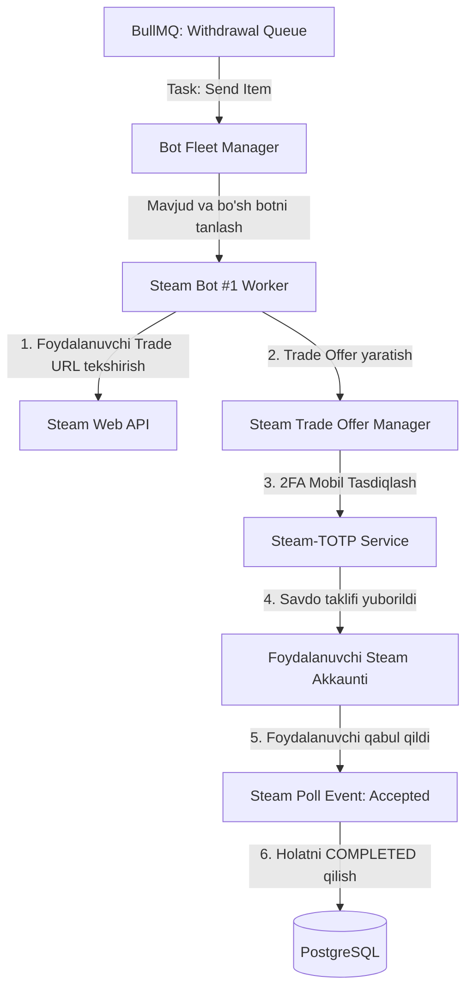

# STEAM INTEGRATSIYASI VA TRADE BOTLAR KLASTERI (STEAM INTEGRATION & TRADE BOT CLUSTER)

**Loyiha:** SKINOZ / csskinuz  
**Texnologiyalar:** Steam OpenID 2.0, Node.js (`steam-user`, `steamcommunity`, `steam-totp`, `steam-tradeoffer-manager`)  
**Til:** O'zbek tili  

---

## 1. STEAM AVTORIZATSIYASI (STEAM OPENID 2.0)

Sayt foydalanuvchilarning Steam hisoblarini OpenID 2.0 orqali xavfsiz bog'laydi:
1. Foydalanuvchi Steam rasmiy sahifasiga yo'naltiriladi (`https://steamcommunity.com/openid/login`).
2. Muvaffaqiyatli kirgach, Steam bizning `return_to` manzilimizga 64-bitli noyob `openid.claimed_id` (masalan, `https://steamcommunity.com/openid/id/76561198012345678`) bilan qaytaradi.
3. Backend ushbu ID ni Steam bilan assimetrik tasdiqlaydi va bazadagi `users.steam_id` ga biriktiradi.

---

## 2. STEAM TRADE BOTLAR KLASTERI ARXITEKTURASI

---

## 3. BOT KLASTERI XAVFSIZLIGI VA BAN HIMOYA STRATEGIYASI

Steam platformasida ommaviy savdo qiluvchi botlar xavfsizligi eng muhim masaladir:

1. **Alohida Proksi (Dedicated Residential/Static IPv4):** Har bir bot alohida toza IP manzilga ega bo'ladi. Barcha botlar bitta IP dan ulanishi qat'iyan taqiqlanadi.
2. **Skinlar Zaxirasini Bo'lib Saqlash (Risk Distribution):** Skinlar yagona botda emas, 5 tadan 20 tagacha botlar o'rtasida taqsimlanadi. Agar bitta bot bloklansa (Trade ban), boshqa botlar zararlanmaydi.
3. **Savdolar Oralig'idagi Tanaffus (Trade Cooldown):** Bitta bot 1 daqiqada 3 tadan ortiq trade yubormaydi. Botlar harakatlari insoniy xatti-harakatlarga taqlid qilib sekinlashtiriladi.
4. **Trade Hold (Escrow) Nazorati:** Savdo taklifi yuborilishidan oldin foydalanuvchining Steam Guard holati tekshiriladi (`tradeoffer.getUserDetails()`). Agar 7 yoki 15 kunlik ushlab turish (Escrow Hold) mavjud bo'lsa, savdo darhol bekor qilinadi va skin o'yinchining platforma inventarida qoladi.

---

## 4. BOZOR NARXLARI SINXRONIZATSIYASI (CS2 PRICE FEED)

Saytdagi barcha CS2 skinlarining narxlari doimiy ravishda quyidagi manbalar orqali real bozorga sinxronlanadi:
* **Asosiy Narxlar Manbai:** CSFloat API / Skinport API / Steam Community Market API.
* **Yangilanish Davri:** Har 1 soatda barcha narxlar keshlanadi.
* **Valyuta Konvertatsiyasi:** USD narxlari O'zbekiston Markaziy Banki joriy kursi bo'yicha UZS ga o'girilib, platforma inventarida aks ettiriladi.
