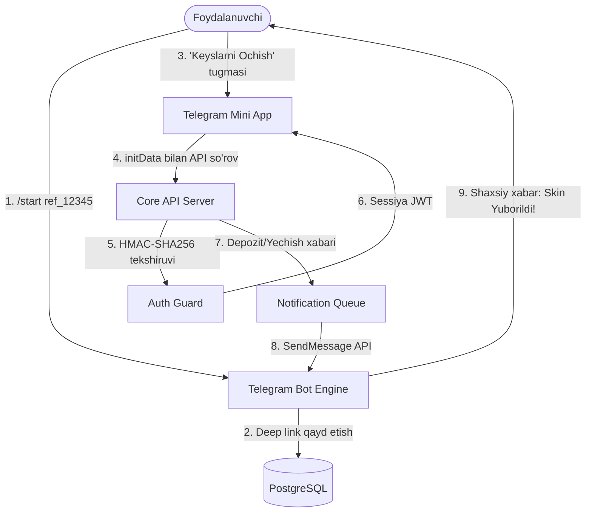

# TELEGRAM MINI APP VA BOT ARXITEKTURASI (TELEGRAM ECOSYSTEM ARCHITECTURE)

**Loyiha:** SKINOZ / csskinuz  
**Texnologiyalar:** Telegram Bot API (grammY / Telegraf), Telegram Mini Apps SDK (`@telegram-apps/sdk`), WebApp initData HMAC  
**Til:** O'zbek tili  

---

## 1. TELEGRAM EKOTIZIMI VA QURILISH PRINSIPLARI

Telegram O'zbekiston foydalanuvchilari uchun asosiy platforma hisoblanadi. Shuning uchun platforma ikki tomonlama sinxron integratsiyaga ega:
1. **Telegram Mini App (TMA):** To'liq veb-ilovani Telegram ichida qulay ochuvchi yuqori tezlikdagi Single Page App (SPA).
2. **Telegram Bot (Daemon):** Foydalanuvchilarga xabarlar, kunlik eslatmalar yuboruvchi va referral havolalarini qayta ishlovchi asinxron bot.



---

## 2. TELEGRAM INITDATA KRIPTOGRAFIK TEKSHIRUVI (BACKEND CODE LOGIC)

Telegramdan yuborilgan `initData` soxtalashtirilmaganligini tekshirish algoritmi:

```typescript
import crypto from 'crypto';

export function verifyTelegramWebAppData(initDataString: string, botToken: string): { isValid: boolean; user?: any } {
  const urlParams = new URLSearchParams(initDataString);
  const hash = urlParams.get('hash');
  
  if (!hash) return { isValid: false };
  
  urlParams.delete('hash');
  
  // Barcha parametrlarni alifbo tartibida saralab birlashtirish
  const params: string[] = [];
  Array.from(urlParams.entries())
    .sort(([a], [b]) => a.localeCompare(b))
    .forEach(([key, val]) => {
      params.push(`${key}=${val}`);
    });
    
  const dataCheckString = params.join('\n');
  
  // 1. Secret Key hosil qilish: HMAC_SHA256("WebAppData", botToken)
  const secretKey = crypto
    .createHmac('sha256', 'WebAppData')
    .update(botToken)
    .digest();
    
  // 2. Hisoblangan hash: HMAC_SHA256(secretKey, dataCheckString)
  const calculatedHash = crypto
    .createHmac('sha256', secretKey)
    .update(dataCheckString)
    .digest('hex');
    
  const isValid = crypto.timingSafeEqual(
    Buffer.from(calculatedHash, 'hex'),
    Buffer.from(hash, 'hex')
  );
  
  // auth_date ning 24 soatdan oshmaganligini tekshirish
  const authDate = parseInt(urlParams.get('auth_date') || '0', 10);
  const now = Math.floor(Date.now() / 1000);
  if (now - authDate > 86400) {
    return { isValid: false }; // Sessiya muddati o'tgan
  }
  
  const user = JSON.parse(urlParams.get('user') || '{}');
  return { isValid, user };
}
```

---

## 3. TELEGRAM BOT BUYRUQLARI VA DEEP LINKING

### 3.1. Deep Link Strukturasi
* **Referral havolasi:** `https://t.me/skinoz_bot?start=ref_a9b3c4d5`
* **To'g'ridan-to'g'ri Keysga yo'naltirish:** `https://t.me/skinoz_bot/app?startapp=case_covert-dreams`

### 3.2. Bot Buyruqlar Menyusi
* `/start` — Boshlash va Mini Appni ochish tugmasi (`InlineKeyboardButton.webApp`).
* `/balance` — Foydalanuvchining hisobidagi UZS balansi va unga tezkor to'ldirish tugmasi.
* `/bonus` — Kunlik bepul keysga o'tish havolasi.
* `/support` — Texnik yordam guruhi yoki chipta yaratish havolasi.

---

## 4. TELEGRAM STARS VA MAXSUS IMKONIYATLAR

1. **Telegram Stars To'lovlari:** Mini App ichida `sendInvoice` metodi orqali to'g'ridan-to'g'ri Telegram Stars valyutasida depozit qilish imkoniyati.
2. **Bildirishnomalar (Push Notifications):**
   - Yutuq yechib olinganda Steam savdo taklifi holati haqida xabar.
   - 24 soat o'tganda "Sizning kunlik bepul keysingiz tayyor!" eslatmasi.
   - Do'sti depozit qilganda referral bonusi tushganligi xabarnomasi.
